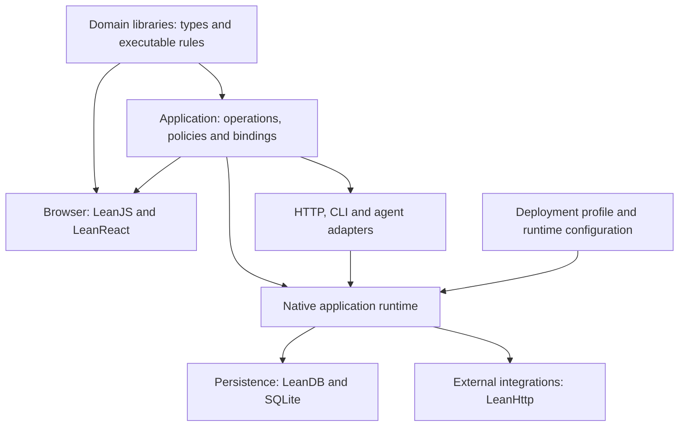

# LeanApp: applications built from executable domain models

An application should carry an executable account of its domain. What a valid order contains, how a price is calculated, who may reserve capacity, and how a reservation changes state should have definitions in Lean that the rest of the application uses. React renders those concepts. SQLite persists their representations. HTTP carries requests to execute their operations.

The proposed framework, called LeanApp here as a working name, makes that domain model the organizing unit of a full-stack application. A developer imports domain libraries, defines the application's behavior, supplies presentation, and chooses a deployment profile. The framework connects those definitions to the execution substrate and makes the obligations at each boundary explicit.

Status: vision and architecture proposal, September 7, 2026. This document follows a source review of `leanreact`, `../leanhttp`, and `../leandb_v2`. Existing mechanisms are identified below; new LeanApp APIs, packages, commands, and deployment profiles are proposals. The existing [LeanReact vision](VISION.md) remains the detailed frontend design. [Implementation status](docs/LEANAPP_STATUS.md) records what has since been built; [release evidence](docs/RELEASE.md) identifies the hosted café.

Repository decision: evolve this checkout into the LeanApp monorepo. LeanReact and LeanJS remain reusable internal libraries, while LeanDB and LeanHttp remain independent dependencies. Preserve the current GitHub URL and compatible package/import names for now. The current [architecture guide](docs/ARCHITECTURE.md) documents this boundary; proposed packaging below is not a claim of separately published packages.

The [implementation plan](FULLSTACK_IMPLEMENTATION_PLAN.md) specifies work packages, repository boundaries, dependencies, and release gates.

## What the repositories establish

The review covered the domain and contract libraries, JavaScript compiler boundary, React integration, native Tickets example, LeanHttp request/session/async APIs, and LeanDB's entity, query, migration, and hosting code. The configurable-offer and typed-program examples illustrated more demanding domain models.

| Repository at review | Existing foundation | Consequence for the framework |
| --- | --- | --- |
| `leanreact`, `d56cf1896776b88c3d36241a05759a0d16bfaf53` | `LeanOntology`, `LeanContract`, Lean-to-JavaScript compilation, composable React components and forms, and a native SQLite-backed Tickets application. | There is already shared executable behavior across browser and server. Extract an application framework around this foundation. |
| `leanhttp`, `9adb3d6535a5e3c46cb2dff8a1000db2449aa207` | Native HTTP client over libcurl, validated `Std.Http` request types, reusable sessions, typed failures, and bounded async batches. | Use it for outbound integrations and native operation clients. Inbound serving belongs to a separate adapter over `Std.Http.Server`. |
| `leandb_v2`, `f01db4837a18f13bed8c22af5be831d42eafbcc8` plus local changes | Typed entities and references, SQLite execution, predicate plans, reference query semantics, typed migrations, CLI/MCP/HTTP surfaces, and managed-runtime controls. | Reuse its persistence and operational machinery. Its current database-oriented public surface needs an application operation layer. |

All three packages pin Lean 4.33.0. LeanDB had existing uncommitted work during review; these observations describe the inspected working trees, not a claim about everything in a published release. No sibling source was changed for this document.

Several findings determine the design:

1. Shared behavior already works. Tickets uses the same `Title.parse` and `applySave` definitions in the browser and native service. The SQLite adapter separates public identities from row IDs, keeps exact revisions, and rejects concurrent stale writes. Its server is explicitly a local fixture without application authentication or a deployment lifecycle. See the [domain](examples/lean/Examples/Tickets/Domain.lean), [storage adapter](examples/native/NativeTickets/Storage.lean), and [native limits](docs/NATIVE.md#limits-and-supported-upstream-proposals).
2. Domain reflection has two useful but separate implementations. `Ontology.RecordDescriptor` retains field types without requiring storage; `LeanDb.Entity` combines field reflection with column codecs, table metadata, and persistence. Bridge their common structure while preserving explicit storage mappings. See [neutral descriptors](engine/LeanOntology/Descriptor.lean) and [entities](../leandb_v2/LeanDb/Entity.lean).
3. Typed operations survive in `LeanContract` through a checked dispatch boundary. LeanDB's `QueryEntry` instead exposes `List String → DbM Json` after registration, and `DbM` contains `IO`. A query label does not enforce read-only execution. The future application layer must preserve typed handlers and supply narrower capabilities. See [operations](engine/LeanContract/Operation.lean), [routing](engine/LeanContract/Transport.lean), [registration](../leandb_v2/LeanDb/Base.lean), and [DbM](../leandb_v2/LeanDb/Db.lean).
4. The transaction boundary needs an upstream API. LeanDB's transaction helper is private; child-table writes can start their own transactions. The Tickets adapter supplies `BEGIN IMMEDIATE` around flat records. General application commands need a public transaction combinator with specified nesting and rollback behavior before they can compose these operations safely.
5. Native hosting primitives are further along than application hosting. LeanDB has instance ownership, public/admin credential separation, readiness, drain, backups, and migration-plan digests. These controls are useful building blocks, but its public CRUD credential is not per-user domain authorization. The [hosting contract](../leandb_v2/HOSTING.md) also identifies the control plane and backup service as future work.
6. Lean's richer models are already visible. Espresso offers describe a configuration space and a pricing function; `Prog ins outs` makes program composition depend on matching tensor interfaces. The offer example also documents how manually maintained summaries and tabulations can drift. A framework should preserve executable rules and manage their derived representations. See [configurations](../leandb_v2/examples/eats/Eats/Config.lean), [offer coherence limits](../leandb_v2/examples/eats/Eats/Offers.lean), and [typed programs](../leandb_v2/examples/kernels/Kernels/Prog.lean).

The resulting direction is an application assembly layer above the existing libraries. Keep each library useful independently and add shared mechanisms where the integration has exposed a concrete need.

## The developer's unit of work is a domain library

A domain library contains ordinary Lean declarations. It can define values and identities, legal states, operations on those states, and the rules used to make decisions. Larger libraries can include a language of configurations or workflows and an interpreter for that language. Libraries expose selected parts through typed interfaces.

An ontology, in this design, is such a reusable vocabulary with executable meaning. It need not be a universal graph, a global schema registry, or a mandatory superclass for every value. A small domain starts with an `inductive`, a `structure`, and a few functions.

Lean provides several useful levels of modeling:

| Domain distinction | Lean expression | What the application gains |
| --- | --- | --- |
| Money in different currencies | `Money currency`, with operations preserving the parameter | An amount cannot accidentally enter an operation for another currency. Conversion requires an explicit rate and rounding rule. |
| A fixed vocabulary versus a changing catalog | An inductive for lifecycle states; entities for products offered today | Code evolution and ordinary data entry have distinct meanings. |
| Alternatives with different required data | A variant such as pending payment, paid with receipt, or refunded with reason | Each state carries the information its behavior needs. |
| A configurable product | A configuration type, an admissibility predicate, and a pricing function | A browser preview, search query, and authoritative quote can use the same rule. |
| A composition with compatible interfaces | An indexed type such as `Workflow start finish` | A library can require that adjoining steps agree on the state passed between them. |
| A global business condition | A predicate over a consistent state snapshot and a command that preserves it | Cross-row rules have a defined evaluation and commit boundary. |

Start with ordinary data types and checked functions. Add dependent indices or proofs where they remove ambiguity or prevent a costly class of mistakes. A component author should usually consume the resulting library through a convenient API; the library can encapsulate the proof work.

Represent uncertainty as part of the domain when it affects a decision. An unknown ingredient list differs from a known empty ingredient list. An estimated price differs from an accepted quote. A missing measurement does not establish a performance bound. Types give these distinctions a place in every consumer of the model.

Composition should work through imports, parameters, and explicit adapters. An ordering library can accept an inventory service and a pricing policy as ordinary records of functions. Two businesses can reuse the ordering library with different policies. Linking customer and billing domains requires an explicit relationship between their identities; matching field names does not establish that relationship.

Keep unrestricted Lean functions available for local composition. When a rule must be stored or edited as data, define a small domain language with typed constructors and an interpreter: a pricing rule can describe a base amount, option adjustments, and explicit overrides. That representation can be decoded and inspected. An arbitrary closure cannot be serialized merely because it has a Lean type. Code-defined rules instead travel as versioned compiled modules, with stored records referring to the applicable rule version.

Derive mechanical interpretations from the information actually present in a model. An inductive can supply the choices for a selector, a typed field path can connect a parser to an editor, and an explicit codec can describe an operation input. A domain predicate still needs an executable decider to validate dynamic input. Presentation, public exposure, and storage layout remain choices supplied by the application. This keeps the domain language expressive without requiring a single intermediate representation that every Lean program must fit.

## Valid values and valid actions

The framework should make it easy to distinguish an editable draft, a validated value, and a decision about current state. They have different lifetimes.

A draft may contain an empty price field. A decoded quantity can establish that the input is positive. A reservation additionally depends on the current inventory. Even a proof about yesterday's inventory cannot reserve today's stock.

This ordinary Lean example illustrates a domain invariant and a reconstruction boundary. It typechecks on the repositories' pinned toolchain and uses no proposed framework API:

```lean
structure Stock where
  capacity : Nat
  reserved : Nat
  fits : reserved ≤ capacity

inductive ReserveError where
  | zeroQuantity
  | insufficientCapacity

def reserve (stock : Stock) (quantity : Nat) : Except ReserveError Stock :=
  if quantity == 0 then
    .error .zeroQuantity
  else if h : stock.reserved + quantity ≤ stock.capacity then
    .ok { capacity := stock.capacity
          reserved := stock.reserved + quantity
          fits := h }
  else
    .error .insufficientCapacity

def stockFromStorage (capacity reserved : Nat) : Except String Stock :=
  if h : reserved ≤ capacity then
    .ok ⟨capacity, reserved, h⟩
  else
    .error "stored reservations exceed capacity"
```

Within Lean's checked model, every `Stock` contains evidence for its bound. The decoder reconstructs that evidence from stored data. The proof is erased during execution; the comparison that establishes it still runs. No client-supplied proof object is trusted.

The server must load the authoritative stock and commit the reservation atomically. Two successful calls against the same old snapshot would otherwise both appear valid. Transaction isolation, command identity, and current authorization remain runtime obligations.

A plain wrapper with a public constructor, such as the current example's `Title`, provides nominal distinction but allows internal callers to bypass its parser. A reusable library must choose between a construction API that enforces validation and a proof-bearing representation when it promises that every value is valid. Descriptors and deriving handlers cannot create that promise by themselves.

The full browser portability of a richer model is a separate check. Native Lean accepts more programs than the current LeanJS subset. The framework should either compile the selected browser functions or explain the unsupported dependency at its source. It must never silently replace local domain computation with a server call.

## The application as a composition of interpretations

A domain function has its meaning in Lean. Each adapter makes part of that meaning available in a particular host. The framework assembles these adapters into a runnable application.



The arrows describe use and assembly, not a requirement for every consumer to import all downstream modules. Pure domain code imports no database, HTTP, or React runtime. Build-time reflection can inspect Lean declarations without putting the compiler in the deployed application.

The proposed `Application` is an ordinary value that collects explicitly exported operations and their bindings. Its module composition checks duplicate operation identities, ambiguous routes, dependency wiring, and conflicting storage ownership. Two modules claiming the same SQL table must agree through an explicit shared mapping; silently choosing the first definition would hide a domain integration error.

Local functions and service records remain directly callable. Only an exported operation needs a wire contract. A heterogeneous registry can erase types after pairing each contract with its correctly typed handler, following the existing `Contract.Route.ofHandler` pattern. Neither local composition nor calling a helper should require registration in a global application object.

A module may expose `quote`, `placeOrder`, and `cancelOrder`, along with selected read models. An application can combine it with an identity module and a customer-facing view. An administrative application can consume additional operations from the same domain library. Publication of a module never automatically publishes every field, table, or function it imports.

## Commands express intent; the runtime commits decisions

Public operations should describe what a user is trying to do. `ReserveStock`, `AcceptQuote`, and `AssignTicket` carry intent that a generic row patch cannot express. Derived CRUD remains useful for explicitly selected administration and simple domains.

An operation keeps its input, output, and domain-error types through the handler binding. Transport failures, invalid input, authentication failure, and domain rejection remain distinguishable. The existing `Operation kind Input Output Error` and `CallError` provide a starting point. An HTTP adapter must decode declared error bodies even when their status is non-success, as the current Tickets client already does.

For state-changing work, use a conventional handler with a pure decision function inside it. A library may package that pattern as a reusable command definition, but application authors should be able to inspect the handler and understand its transaction. The model does not require every application to adopt event sourcing.

The standard command lifecycle should be:

1. Authenticate the caller, select the public operation, and decode its versioned input. Obtain actor identity from the authentication adapter.
2. Begin an authoritative transaction. Resolve the requested domain identities and the current policy facts needed for authorization.
3. Check authority for this actor, tenant, and operation. Resolve an idempotency key within that scope, checking that a reused key has the same canonical request. Replaying a result must also respect current access policy.
4. Load a consistent state snapshot and check any expected revisions. Run the domain decision against that state, with explicit time or other external facts where required.
5. Persist the accepted state changes, idempotency result, and any durable effect intents in the same transaction. A typed domain rejection must not accidentally commit partial changes.
6. Return the committed result and let background execution deliver the effect intents.

The transaction abstraction must define how domain errors and database errors cause rollback. Its first SQLite interpreter should use a documented write-locking policy and support composed child-table operations without nested `BEGIN` failures. A plain `Except.error` returned inside another successful result is not enough to specify rollback.

An expected revision prevents a stale edit from overwriting a newer edit. An idempotency key answers a different question: whether a retried request is the same operation whose reply was lost. The framework needs both. Scope deduplication by actor or tenant, operation version, and key; store a request digest and define retention. Revision checks alone cannot prevent duplicate order creation.

Keep slow network work outside the database transaction. A notification or external reservation becomes a typed intent recorded in an outbox. Workers claim work with a lease, retry according to policy, and record a typed outcome. A crash after delivery but before acknowledgement can cause another attempt, so use a stable external idempotency key when the provider supports one. Otherwise expose an uncertain outcome that can be reconciled.

Longer workflows model intermediate states explicitly. A payment request can be pending, confirmed, rejected, or awaiting reconciliation. A provider callback is new untrusted input; verify it and deduplicate it before applying the next domain transition. Clock readings and random identifiers enter through host capabilities and become explicit decision inputs when reproducibility matters.

The effect adapter must expose the capabilities its host actually supports. LeanHttp currently runs async transfers on dedicated workers and has no transfer cancellation API; its request timeout excludes queueing time. The application runtime therefore needs bounded admission and an overall deadline in addition to per-request timeouts. Browser fetch has a different set of controls from libcurl. Keep those differences in host bindings while sharing operation semantics. See [LeanHttp's async contract](../leanhttp/README.md#async-requests-and-bounded-batches).

## Authority belongs in application semantics

LeanApp should define a small principal model and accept authentication adapters, such as a browser session or an identity-provider token. Domain libraries then express policies over that principal and the relevant facts. Authentication establishes the actor; the domain policy decides what that actor may do.

Tenant or identity scope received in a URL is a lookup input, not authority. Resolve it against the caller's current access. A typed `EntityId Ticket` distinguishes ticket IDs from user IDs but does not establish existence, tenancy, or ownership. The current scoped IDs should remain separate from SQLite's internal `Id` and `Ref` values.

Read operations need policy too. Filter access at the authoritative query boundary and construct a public projection that omits private fields. Public manifests describe those projections and approved operations. They must not reveal the entire storage schema simply because the server imports it.

Use narrow read and command capabilities in ordinary application code. A query handler should not receive a writable connection or unrestricted `IO` through its routine interface. Native escape hatches remain possible, but their use makes the extra assumptions visible. This is a programming interface discipline; executing untrusted Lean extensions requires a separate process sandbox.

The first browser host should use a documented same-origin session model, including secure cookie handling and CSRF protection for mutations. A typed operation contract cannot implement these HTTP responsibilities. Keep service credentials and administrative operations out of browser artifacts.

## Storage follows the domain's representation needs

Support a convenient direct mapping for ordinary records and an explicit mapping for richer models. A domain value may occupy several tables, a validated JSON column, or an indexed summary plus an authoritative representation. Its storage mapping has an encode function, a checked reconstruction function, and a schema with migration history.

Do not force indexed workflows or proof-bearing values into a universal row class. Store the required data and re-establish the relevant checks when reconstructing the domain value, as `Prog.ofRows` already does for typed programs. A field descriptor grants read access; arbitrary field replacement requires a separate capability that preserves the whole value's invariants.

Keep storage codecs, public wire codecs, and in-process JavaScript representation distinct. LeanJS uses tagged constructors and `bigint`. Public contracts currently encode exact integers using tagged decimal strings. SQLite integer columns have finite range, and the current LeanDB `Nat` encoder wraps values at or above `2^63`. Framework storage mappings must reject unrepresentable values or choose an exact representation before encoding. The Tickets revision-as-text mapping is a concrete precedent.

Codec correctness needs explicit laws or tests. A validating decoder cannot satisfy a round-trip law over a type whose public constructor admits invalid values. SQL ordering also needs an encoding that preserves the domain's order; decimal text chosen for exactness does not automatically sort numerically. Make these adapter capabilities visible.

Derived data belongs to its defining rule. A price table or search summary should declare the source fields and rule version it depends on, with a recompute or invalidation strategy. Synchronous derived values update in the authoritative transaction. Asynchronous projections record their source revision and expose their freshness. This directly addresses the coherence gap documented by the configurable-offer prototype.

The first framework storage backend is SQLite through LeanDB. A later PostgreSQL or remote SQL backend would need its own execution and migration semantics. Domain code can remain reusable while physical mappings and query plans change; the framework should not promise that changing a connection string ports those implementations.

## Queries retain executable meaning

A query is a typed computation with a reference meaning. The storage engine may optimize it only within the conditions that preserve that meaning. LeanDB already provides `selectSpec`, a typed predicate representation, and `Pred.approx_sound`; these are valuable foundations.

The proof about predicate approximation is one part of the argument. SQL rendering, codec comparisons, null behavior, and the reification of Lean predicates must also agree with the reference interpretation. A residual predicate can remove false positives but cannot recover rows excluded by incorrect pushdown. Ordering, duplicate behavior, and pagination need their own checks.

`Ontology.Query` currently describes ordered local stages containing Lean functions. It is neither a serialized query language nor a SQL optimizer. Bridge supported stages to LeanDB incrementally, with an explainable plan that shows pushed work and residual work. Test the optimized result against the reference result on the same snapshot.

Public search should initially use named operations with typed parameters and explicit budgets. Arbitrary executable Lean functions are useful within trusted code, but they are not request payloads. A user-configurable filter language can later be a separate typed data structure with a bounded interpreter.

Bound result size, execution time, and expensive residual scans. If a budget is exceeded, return a typed limit result that identifies the incomplete computation. Use deterministic tie-breaking and define whether pagination refers to a snapshot or can observe intervening changes.

Derived query dependencies can help invalidate client caches, but static footprints are only sufficient when they cover the full computation. Start with explicit invalidation declarations on commands and module-scoped refresh. Add automatic invalidation after conformance tests establish its coverage.

## React is the presentation interpreter

LeanReact remains the frontend library. Its existing `Component Props`, `Hook`, and `Action` model already supports ordinary composition. LeanApp supplies typed service clients, application routing conventions, and the runtime context that components consume.

A form edits a draft of a command input. It can run portable parsers and pure domain calculations immediately, including a price preview or an explanation of a rejected configuration. Submission sends a typed command. The server recomputes the authoritative decision using current facts.

Form descriptions may select default editors, but an application supplies layout and can replace any editor. A generic configuration editor, an accessible custom product picker, and a CLI should call the same pricing function. The model's semantics do not determine the product's visual design.

Add a small typed route layer that binds path parameters and search state to page inputs. A shared operation cache should key by service instance, actor/tenant scope, operation version, and canonical input. Clear or replace its ownership on session changes. Existing resource generations and service-keyed mounts supply useful behavior for stale replies; they are not yet a shared cache or subscription protocol.

Represent loading, conflicts, and uncertain outcomes as states the UI can render. Preserve drafts after a failed or conflicting mutation. Optimistic behavior is an optional prediction based on shared domain code, with a defined reconciliation path after the server response. Cancelling a browser request does not establish that the server cancelled the command.

Use ordinary CSS and explicit bindings to existing React libraries. Generated bindings can later remove repeated conversion code, while maintaining the distinction between Lean's ABI and JavaScript objects. Accessibility and React lifecycle behavior still need browser qualification.

The initial deployment should serve static browser assets and use client rendering. This allows one native Lean server process at runtime. React SSR can be an optional JavaScript renderer with request-scoped data and hydration checks. Server Components require their own adapter and are outside the first application release.

A CLI or agent adapter consumes the same approved operation registry. Generated tool descriptions can expose typed inputs and structured errors, while calls pass through the same policies and command executor as the browser. An agent may propose a configuration or a source change; the domain checker evaluates the configuration, and a source change follows the normal release and migration process. Runtime tool access does not grant permission to load and execute arbitrary Lean code.

## Packages and the build experience

Keep the existing libraries independently usable. The proposed package split is:

| Layer | Responsibility |
| --- | --- |
| `LeanOntology` | Portable identity, typed reflection, validation, and explicit codecs. Extract a small independent package as consumers require it. |
| `LeanContract` | Operation definitions, typed errors, explicit publication, and transport interpretation. |
| `LeanApp` | Application/module composition, handler binding, policy context, and the contracts for transactions and durable effects. |
| `LeanApp.Server` | `Std.Http.Server` integration, static assets, sessions, limits, runtime lifecycle, and private administration. |
| `LeanApp.Sqlite` | LeanDB mappings, transactions, migrations, idempotency, and the outbox interpreter. |
| `LeanApp.HttpClient` | Native LeanHttp and browser-fetch adapters for declared contracts; host capabilities remain distinct. |
| `LeanApp.Web` | LeanReact integration, typed navigation, operation resources, and command forms. |
| `LeanJS` and `LeanReact` | Existing compiler and presentation libraries, retaining their standalone APIs. |

These are logical boundaries first. Avoid a mandatory package split for every small application. An application can begin in one Lake package with separate entry modules:

```text
Shop/
  Domain/        Values.lean, Configuration.lean, Rules.lean, Orders.lean
  Contracts/     Public.lean
  Application/   Commands.lean, Policies.lean, Services.lean
  Storage/       Mapping.lean, Queries.lean, Migrations.lean
  Server/        Main.lean
  Web/           Routes.lean, ProductPicker.lean, Checkout.lean
  Tests/         Domain.lean, Commands.lean, Contracts.lean
web/             host entry point, styles, foreign React adapters
lakefile.toml
lean-toolchain
package.json
```

Extract neutral reflection with compatibility adapters. Keep existing `LeanDb.Entity`, CLI behavior, persisted schemas, and LeanReact imports working while consumers migrate. Preserve typed definitions before generating legacy argv runners or public HTTP bindings. Avoid a wholesale rewrite of the sibling repositories.

The intended command surface is small. These commands do not exist yet:

```text
lake exe leanapp new shop
lake exe leanapp dev
lake exe leanapp check
lake exe leanapp build
lake exe leanapp doctor --profile railway-sqlite
```

`dev` manages native serving and the browser build, with useful Lean diagnostics. A backend restart must preserve the development database. A changed schema produces a migration plan; a normal reload should not silently discard data. Component state survives only when the new component state representation remains compatible.

`check` verifies Lean code, browser reachability, handler/contract agreement, public exports, and storage/migration consistency. Diagnostics should name the domain declaration and the adapter that cannot interpret it. For example: a browser quote reaches a native-only primitive, a storage mapping can overflow, or a command has no authority binding.

`build` emits the native executable, selected browser modules, static assets, and release manifests. Builds pin the Lean toolchain, Lake dependencies, and JavaScript lockfile. Generated output is disposable; editable behavior stays in Lean and explicit host adapters. Production builds must work in a clean Linux checkout with no sibling `.lake` paths or cached macOS objects.

The existing LeanJS compiler lowers unoptimized pure LCNF through internal Lean compiler APIs. Its support for exact integers, variants, closures, and higher-order functions is a starting portability profile. Toolchain upgrades require compiler/runtime conformance checks, and browser exports need a checked dependency graph that excludes native-only implementations and private server modules. See the [compiler ABI](engine/LeanJS/ABI.md).

Record separate identities for the application release, public contracts, storage schema and migration lineage, and compiler/runtime ABI. A schema fingerprint does not detect a changed pricing policy. A code digest detects a change but cannot decide whether that change preserves business meaning.

## Hosting is another explicit interpretation

The production artifact should be a Linux container image containing the native executable and static assets, plus required runtime libraries. Build Lean code and browser assets in builder stages. Include the Lean runtime dependencies actually required by the linked binary; include libcurl and certificate roots when outbound HTTPS is used. A client-rendered application should not require Node in its runtime image.

The process contract is conventional: bind public HTTP on `0.0.0.0:$PORT`, read secrets and backing-service locations from environment configuration, write structured logs to standard streams, expose liveness and readiness, and handle `SIGTERM` with a bounded drain. Provider TLS termination is compatible with that contract. Forwarded headers are trusted only under a declared proxy policy.

Reuse LeanDB's instance-ownership and migration controls beneath the application runtime. Route public traffic through the application's approved operations and policy checks. Keep administration on an unexposed listener or another authenticated private control path. Starting the managed LeanDB CRUD server alone does not produce the application authority model described here.

Deployment profiles should describe required capabilities: durable local storage, instance ownership, private service connectivity, and process shutdown behavior. Validate them against provider configuration and runtime probes. A Lean type can express a requirement; it cannot prove that an externally configured volume is mounted and writable.

### Railway with local SQLite

The first compact profile is one native application service with a persistent volume mounted at `/data`. The SQLite database, journal files, and instance lock live there. Static assets live in the image. Keep one authoritative owner of the instance, with a bounded internal queue and background outbox execution.

Railway mounts volumes when the service starts; they are unavailable during image build and pre-deploy commands. Consequently, a local-database migration must execute after the mount becomes available and before the application becomes ready. The startup migration gate must require an explicitly selected plan and backup policy. [Railway volume lifecycle](https://docs.railway.com/volumes).

Railway currently prevents replicas for services with volumes and prevents simultaneous deployments from mounting the same service volume. Its documentation notes brief deployment downtime for that profile. Accept that property in the first release and expose it in deployment planning. Scaling requires changing the topology. [Railway volume limitations](https://docs.railway.com/volumes/reference).

Set a readiness probe, test the volume's permissions under the deployed process identity, and configure termination grace to fit the application's drain budget. Export consistent SQLite backups off the instance volume and regularly restore them into a fresh instance. Provider storage snapshots can complement this application-level verification.

### Heroku with a separate durable service

Heroku can run a containerized native web process on its supplied `$PORT`. Its container runtime does not support volume mounting, and dyno files disappear on restart. Therefore a local SQLite file in a web dyno cannot be the durable production database. [Heroku container runtime](https://devcenter.heroku.com/articles/container-registry-and-runtime), [dyno filesystem](https://devcenter.heroku.com/articles/dynos).

The initial Heroku profile should run a stateless Lean web gateway and static assets on Heroku, with an authoritative Lean application service and its SQLite volume on a durable host. The gateway forwards typed application operations to that service through LeanHttp. The service executes the complete command transaction, including policy checks and deduplication.

Forward authenticated actor context using a verified delegation mechanism with a defined audience and expiry. The durable service must not trust a plain actor ID supplied by the gateway's caller. Service credentials remain server-side, and user-facing routes expose only the approved contract.

This split places the atomic boundary beside the database. Separate remote calls to load a row and later update it cannot substitute for a transaction. Existing LeanDB argv RPC is useful for tools, but the Heroku path needs a typed application-operation client and authoritative handlers on the durable service.

This profile hosts the web tier on Heroku; it requires a separate durable tier. A deployment entirely within Heroku would require another storage backend, such as a future PostgreSQL interpreter, with its own qualification. Neither that interpreter nor a complete hosted LeanDB product exists in the reviewed code.

### Other hosts and operational limits

A host offering a compatible Linux process and durable local disk can use the SQLite profile after adapter qualification. A host with only ephemeral processes uses the remote-service profile. SQLite WAL requires participating processes to be on the same host; a network filesystem is not a shortcut to multi-host ownership. [SQLite WAL constraints](https://www.sqlite.org/wal.html).

Treat storage replicas, multi-region writes, and offline synchronization as separate future systems with explicit consistency semantics. More web replicas can increase stateless capacity; they do not increase the write capacity of one authoritative SQLite instance.

Long-running work returns a durable job identity that clients can poll. Worker placement follows storage ownership: local workers can run within the owning runtime, while separate workers call the authoritative service. Process restarts must recover leased work without losing its operation identity.

## Evolving a running domain

A domain change can affect more than table shape. Adding an order state changes exhaustive handlers and UI branches. Changing a validator changes which historical rows can be reconstructed. Revising a pricing rule changes results over identical stored data.

A release plan should identify the changed domain declarations and their affected public contracts, stored representations, and derived projections. Derivation can report structural differences; an author must supply the intended interpretation of historical data when that interpretation is ambiguous.

Use LeanDB's frozen schema history and typed transformations for storage evolution. Add domain-level checks for preserved identities, relationships, and selected business properties. A well-typed migration can still choose an inappropriate default, so compilation is one part of review.

For the single-owner profile, the release transition is: drain the old runtime, retain a consistent backup outside its volume, transfer instance ownership, check the candidate's migration-plan digest, apply the selected migration, verify the new instance, and admit traffic. The Railway adapter must realize those steps within its actual volume lifecycle. A failed migration leaves the service unready and retains recovery artifacts.

Retain explicit contract versions during rollout. An old browser either uses a supported contract or receives a typed incompatibility response that preserves its draft. Start with explicit version compatibility, following the current equality check, before attempting structural compatibility analysis. Keep versioned assets available for supported clients.

Schema compatibility, wire compatibility, and business compatibility are independent. Restoring an earlier database after the new release has accepted writes discards those writes. Prefer a forward repair when necessary; a restore must make the data-loss boundary explicit.

## A focused path to the first framework release

The first release should demonstrate both an existing application carried forward and a richer domain made practical by Lean. It should include Railway and Heroku deployment recipes backed by actual qualification, with the topology of each recipe stated plainly.

| Stage | Deliverable | Acceptance condition |
| --- | --- | --- |
| 1. Extract the application boundary | A small LeanApp package, typed handler registry, reusable HTTP binding, and public LeanDB transaction API. Move the existing Tickets adapter onto these interfaces. | The browser and a native client use the same operation definitions. Nested storage operations have specified rollback behavior. Existing library consumers continue to build. |
| 2. Establish authoritative commands | Authentication/policy binding, scoped idempotency, read capabilities, and a transactional outbox with a deterministic test interpreter. | Concurrent commands, a lost response followed by retry, authorization revocation, and a crash around effect delivery all produce the specified outcomes. |
| 3. Build a domain that exercises Lean | A configurable ordering application based on the Eats vocabulary, with shared pricing, checked configurations, inventory reservations, and explicit order states. | Changing a pricing rule updates browser previews and server decisions from one source. Derived search data is rebuilt or marked stale. Two clients competing for the last unit cannot both reserve it. |
| 4. Qualify complete releases | Clean Linux image builds, migration/recovery workflow, Railway SQLite deployment, and a Heroku web deployment using a durable Lean service. | Data survives restart and redeploy. Recovery is exercised from an exported backup. The Heroku gateway preserves authority, transaction, and retry semantics across the network. |
| 5. Prove independent reuse | A second presentation and CLI or agent consumer using the same domain libraries; reusable project generation and diagnostics. | A consumer changes its UI without copying pricing or command rules. A domain evolution produces understandable contract and migration consequences for independently built clients. |

Use the existing Tickets application as the first integration target because it already exercises shared rules and conflicts. Use configurable ordering to assess domain expressiveness because a flat editor alone would leave the strongest part of the proposal untested.

Do not make a universal effect algebra, a new frontend reconciler, a general distributed database, or a hosting control plane prerequisites for these stages. Introduce general abstractions when the two applications expose the same need. Keep typed manual adapters available throughout.

## Evidence required for the claims

The framework's guarantee is specific: checked domain code, validated external representations, and tested execution adapters. Whole-system verification would require additional arguments about compilation, native libraries, storage, authentication, and deployment.

| Claim | Required evidence |
| --- | --- |
| A rule is shared across hosts | Differential native/JavaScript execution of the same declaration, including failure cases and exact integers. |
| A value satisfies an invariant | A checked construction boundary, or a proof with stated assumptions; malformed storage and wire inputs are rejected. |
| A command preserves current state | Concurrent transactional tests, domain-rejection rollback, and tests of authority changes during execution. |
| Retries preserve command identity | Crash and duplicate-delivery scenarios that verify deduplication and distinguish uncertain external outcomes. |
| Query optimization preserves meaning | Reference-versus-optimized results, including joins, nulls, ordering, and limits; stated codec and rendering assumptions. |
| A release is deployable | A fresh Linux build and actual provider checks for persistence, signal handling, migration failure, old clients, and restore. |
| The abstractions are useful | Independent consumers reuse domain behavior and replace presentation or service adapters without copying that behavior. |

Measure compile time, browser bundle size, local interaction latency, server command latency, and SQLite contention using the sample applications. Publish the workload and separate framework overhead from React and application dependencies. The existing local render benchmark is not a production-capacity estimate.

During this review, `npm test` passed, including native/JavaScript parity, ontology and contract checks, React runtime/integration checks, negative type cases, and TypeScript checking. `bash tests/native/check.sh` rebuilt the native example against cached sibling dependencies and passed SQLite concurrency, protocol, and restart checks. `bash tests/native/run-http.sh --no-build` passed actual loopback `Std.Http`/LeanHttp round trips after allowing the local socket test outside the sandbox. The stock example above also typechecked. Browser automation and Linux/provider deployment tests were not rerun for this document; existing browser qualification is recorded in [QUALIFICATION.md](docs/QUALIFICATION.md).

The decisive product test is a change in domain meaning: add a product choice that alters admissibility and price, carry existing orders through the chosen migration policy, and let both a browser and a CLI place the resulting order. Record every rule that had to be copied into another language or adapter. Each such copy identifies a boundary the framework still needs to improve.
