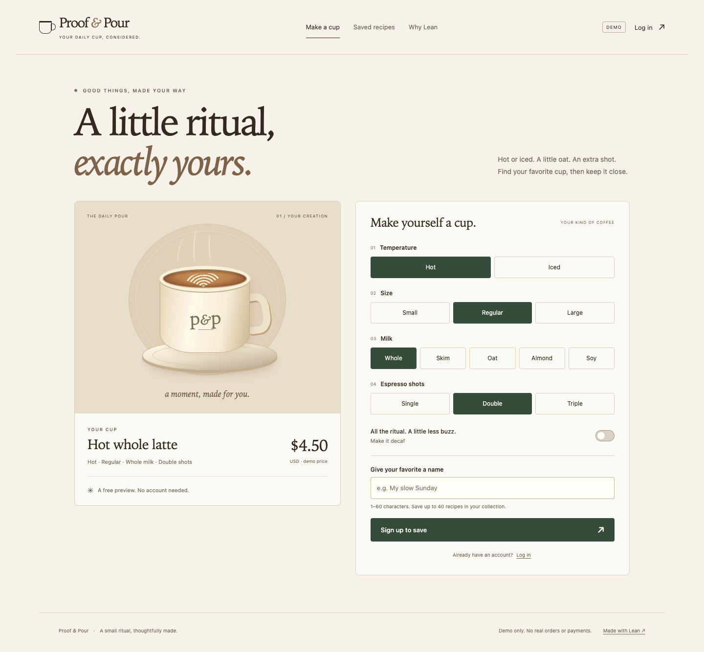

# LeanApp

Build full-stack applications around a domain model written in Lean. Share executable rules between the browser and a native server, and use types and proofs to express the distinctions your business depends on. React, SQLite and HTTP provide the execution layers around that model.

[Try Proof & Pour](https://proof-and-pour-production.up.railway.app) · [Try Private Notes](https://private-notes-production.up.railway.app) · [Get started](docs/GETTING_STARTED.md) · [Documentation](docs/README.md) · [MIT license](LICENSE)



LeanApp is experimental. The café is hosted on Railway and has passed public browser/API and restart-persistence checks. The prepared full-stack candidate is `0.2.0-rc.1`; it has not been tagged or published as a package. The existing [v0.1 release](https://github.com/theoriclabs/lean-react/releases/tag/v0.1) covers LeanReact's frontend foundation. [Release evidence and limits](docs/RELEASE.md) distinguish the two.

## Why use Lean for an app?

When a price, inventory rule or workflow matters, give it a precise definition that every caller can use.

The [ordering model](examples/ordering/Ordering/Domain/Values.lean) distinguishes currencies in the type of an amount:

<!-- lean-check: readme-money -->
```lean
import Ordering.Domain.Values
open Ordering

def subtotal : Money .usd := ⟨450⟩
def extraShot : Money .usd := ⟨75⟩

#eval (subtotal.add extraShot).minor -- 525

-- An amount in EUR cannot be passed to a USD addition:
-- def invalid (usd : Money .usd) (eur : Money .eur) := usd.add eur
```

The example uses exact integer cents. Uncommenting the last line produces a type error before the application runs. The [domain guide](docs/DOMAIN_MODELING.md) explains the model and its rejection tests.

Workflow states can carry different data. The [order model](examples/ordering/Ordering/Domain/Orders.lean) accepts an `Order c .placed` for payment and returns an `Order c .paid`. Passing a cancelled order to that function is a type error. For inventory, a `Stock` value carries the invariant `reserved ≤ capacity`; checked constructors and updates establish that bound.

The café's browser preview and native save handler call the same [Lean pricing model](examples/ordering/Cafe/Model.lean). The UI also uses that model to disable unavailable choices: iced excludes Small, and decaf excludes Triple. There is no second pricing formula in the JavaScript app. Tests cover all 180 configurations, including the 125 admissible ones, against native execution, generated JavaScript and independent expected prices.

Start with ordinary types and functions. Add indices or proofs where they prevent a costly mistake. Lean checks the properties you actually encode; it does not automatically prove a business specification correct or make HTTP, SQLite, FFI and browser execution formally verified. The backend still validates untrusted input.

The [Private Notes example](docs/PRIVATE_NOTES.md) goes further: authorization evidence travels from the authenticated request into a protected database read. Its Lean model proves that responses contain only the caller's permitted rows, and that changes to hidden rows cannot change the modeled list, search, count or export response. The companion agent-change demonstration shows real compiler failures when a candidate patch removes an owner/tenant check, plus the separate checks needed to reject admitted proofs and policy edits. This is a checked model with tested native integration—not a claim that all of SQLite, authentication or agent execution is formally verified.

## One framework, composable libraries

This is the LeanApp monorepo. LeanReact remains its frontend library; LeanJS is the Lean-to-JavaScript compiler. Each has its own module boundary and can be used without the native stack.

| Part | What it provides |
| --- | --- |
| [LeanApp](engine/LeanApp.lean) | Application assembly, explicit operation exports, policies and typed capabilities. |
| [LeanOntology](engine/LeanOntology/API.md) and [LeanContract](engine/LeanContract/Operation.lean) | Shared identities and validation, wire codecs, typed operations and transports. |
| [LeanReact](docs/LEANREACT.md) | React components, hooks and forms authored in Lean. |
| [LeanJS](engine/LeanJS/ABI.md) | Compilation of the supported Lean subset to JavaScript, with generated declarations and manifests. |
| [Native adapters](adapters/native/LeanAppNative.lean) | Integration with the independent LeanDB and LeanHttp libraries, plus authentication and SQLite persistence. |

LeanDB and LeanHttp remain independent dependencies; their source is not being moved into this repository. LeanHttp handles outbound HTTP. The native server uses Lean's `Std.Http.Server`. The [architecture guide](docs/ARCHITECTURE.md) explains the dependency boundaries and a request's path through the café.

The repository URL stays `theoriclabs/lean-react` for now. Existing imports such as `import LeanReact`, the Lake package name `leanreact`, and development override `-Kleanreact=...` remain compatible. LeanApp is the product name; this naming change does not require an application migration.

## Run locally

From a working checkout containing the LeanApp changes, with Node 22.13+ and the pinned Lean toolchain available:

```sh
npm ci
npm run build:engine
```

That builds the portable framework, compiler and frontend libraries without native database dependencies. To start the Lean-authored frontend playground:

```sh
npm run dev
```

Open **http://localhost:4173**. For the full-stack café, the reviewed LeanDB and LeanHttp checkouts and OpenSSL 3 development files are also required:

```sh
npm run build:cafe
(cd adapters/native && lake build leanapp_cafe)
npm run dev:cafe
```

Open **http://127.0.0.1:4180**. Accounts and recipes are stored in `.lake/cafe.sqlite`. The [getting-started guide](docs/GETTING_STARTED.md) covers dependency layout, source overrides, a rule edit and troubleshooting. The unpublished framework is not available by cloning the old `v0.1` tag.

## Proof & Pour

[Try the hosted café](https://proof-and-pour-production.up.railway.app): configure a drink without an account, then sign up with a username and password to keep a private collection of up to 40 recipes. Sessions and recipes survived an actual Railway restart.

The café's domain model and authenticated storage API are Lean. Its presentation is ordinary React/JavaScript, demonstrating that you can adopt Lean for the domain without rewriting an existing React UI. The [LeanReact playground](docs/LEANREACT.md) separately demonstrates components authored in Lean.

This is a recipe demo, with no real orders or payments. Use a disposable password; account recovery is unavailable.

## Private Notes

[Try the hosted authorization demo](https://private-notes-production.up.railway.app). Sign up, search and export your synthetic notes, then try reading a known foreign-owner or other-tenant note. Open **Inspect agent changes** to see actual verification output for patches that omit authorization, weaken ownership or admit an unfinished proof.

The example has nine audited theorem dependencies and eight rejected candidate patches, backed by native, HTTP and browser checks. Original sessions and notes survived a Railway restart on their own persistent volume. It demonstrates why Lean can be valuable in an agent-assisted codebase: a requested feature still has to preserve the encoded contract. It also shows where that protection ends—an agent must not control the specification, verification gate and release permissions it is supposed to obey. Read the [guide and proof boundary](docs/PRIVATE_NOTES.md) before treating this experimental example as a production security architecture.

## Learn, build and contribute

Follow [getting started](docs/GETTING_STARTED.md) to run and modify the café, then [domain modeling](docs/DOMAIN_MODELING.md) to understand the types and executable rules. The [frontend guide](docs/HOW_TO.md) teaches LeanReact through a complete form. [Hosting](docs/HOSTING.md) documents the container, persistent volume and HTTPS configuration.

For framework work, read [architecture](docs/ARCHITECTURE.md) and the [contributor guide](CONTRIBUTING.md). `npm run test:docs` checks the main documentation's local links and marked Lean examples. The [documentation index](docs/README.md) routes to API references and the design history.

LeanApp is useful when expressive domain models and shared executable rules justify an experimental toolchain. Expect API changes and a limited Lean-to-JavaScript subset. Password recovery/MFA, durable command receipts and outbox delivery, general application scaffolding, broad platform distribution and Heroku qualification remain unfinished. See [implementation status](docs/LEANAPP_STATUS.md) for the exact boundary.
