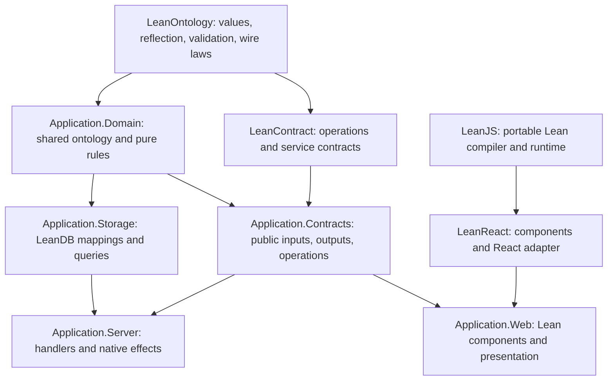
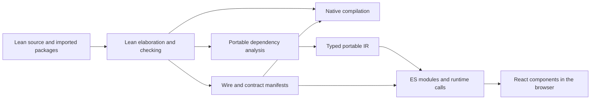

# LeanReact: expressive applications from composable Lean libraries

Status: proposed ideal state. Written September 5, 2026, after inspecting the local `leandb_v2` and `leanhttp` working trees. LeanReact is currently an empty project. The APIs, syntax, package names, and commands below are design proposals; examples describe the intended developer experience and are not an implemented API.

## The goal

Write the application's domain model and behavior in Lean. Use that same code to build a database, expose a service, render a React interface, and provide tools to another program. A change to a domain concept should reach every consumer through imports and checked interfaces.

LeanReact should make Lean a practical frontend language. Developers should be able to write a component, its state transitions, input validation, and interactions in Lean, compile it into an ordinary React application, and reuse domain functions that also execute in a native Lean backend. React provides rendering and its component ecosystem. Lean provides the language in which the application is understood.

The motivation is familiar from Clojure/ClojureScript and full-stack TypeScript: developers benefit from using one language and sharing executable code across hosts. Clojure's portable source conventions explicitly support shared code with small platform-specific boundaries. ClojureScript treats JavaScript as a compilation target with access to the host ecosystem. Those are useful precedents for Lean. [Clojure reader conditionals](https://clojure.org/guides/reader_conditionals), [ClojureScript rationale](https://clojurescript.org/about/rationale).

Lean adds an expressive language for describing and combining abstractions. Functions can take components, components can take render functions, types can parameterize whole families of interfaces, and a domain package can supply behavior to several applications. Types make those combinations discoverable and useful. Proofs are available when they earn their cost, but they are not the main reason to build LeanReact.

Consider building a support workspace. Import the ticket ontology, a people directory, a generic board, and an existing React rich-text editor. Define a small projection connecting people to ticket assignees. Supply a card renderer to the board, compose an assignee picker into a form, and reuse the backend's prioritization function in a local preview. The interesting work is deciding how these pieces combine to make the product.

A second application should be able to reuse that logic and present it as an inbox, a table, or a mobile triage screen. A CLI or an agent should be able to use the same operations. Sharing an ontology should increase the number of things a developer can build without requiring a shared database, UI framework, or application architecture.

## Design priorities

Composability and expressiveness are the primary product criteria. Prefer a small set of powerful primitives that can be combined in unforeseen ways. A developer should be able to turn a repeated pattern into a function, a component, or a library without asking the framework for a new extension point.

The priorities are, in order:

1. Make useful ideas easy to express and combine. Support ordinary Lean functions, parameterized types, closures, and higher-order components throughout the portable language.
2. Make domain code reusable across applications and hosts. Sharing behavior matters as much as sharing record definitions.
3. Make existing React and JavaScript libraries easy to compose with Lean code. Adoption should work one component or domain module at a time.
4. Use types to improve APIs, inference, and feedback. Preserve meaningful distinctions without making applications carry incidental machinery.
5. Add stronger invariants and proofs where they simplify a difficult problem. They should be optional layers that libraries can encapsulate.

A sortable list should take a sort key and a row renderer. A dialog should take content and actions. Neither should require a proof, an application-wide event algebra, or an explicit effect row before it becomes useful. Complicated interactions can choose more structure later.

Runtime validation and basic safety still belong at external boundaries. TypeScript's erased types are a useful reminder that shared declarations do not validate network data on their own. That is a boundary responsibility, not the organizing principle for every UI abstraction. [TypeScript's explanation of erased types](https://www.typescriptlang.org/docs/handbook/typescript-from-scratch).

## Composition is the central API

### Everything reusable should remain an ordinary value

Components, render functions, field descriptions, codecs, query fragments, and presentations should be values that functions can accept and return. A registration macro can make exports convenient, but registration should not be required merely to compose two local values.

The public surface should be small enough to remember:

| Primitive | What it makes possible |
| --- | --- |
| `Element` | Construct a renderable tree and place it inside another tree. |
| `Component Props` | Package a reusable React component with arbitrary typed props. |
| `Hook α` | Reuse stateful rendering logic while letting the caller choose the UI. |
| `Action α` | Compose browser-side work and event callbacks. |
| `FieldPath A B` | Describe a field while retaining the source and value types. |
| `Editor α` | Reuse an input interaction for values of a particular domain type. |
| `Operation kind Input Output Error` | Reuse an application operation across clients and transports. |

These names are the proposed vocabulary, not a requirement to wrap every function in a descriptor. Pure domain functions remain ordinary Lean functions. A formatter can simply be `Title → String`.

### Components compose through props and functions

Props can contain values, callbacks, children, other components, and render functions. Most of these are local values; only a network or persistence boundary requires serialization.

```lean
structure ListProps (α : Type) where
  items : Array α
  key : α → Key
  row : α → Element
  empty : Element := text "Nothing here yet"

@[react]
def ListView (α : Type) : Component (ListProps α) := component fun props => do
  pure <| if props.items.isEmpty then props.empty
    else keyedEach props.items props.key props.row

def ticketList (tickets : Array TicketSummary)
    (openTicket : EntityId Ticket → Action Unit) : Element :=
  element (ListView TicketSummary) {
    items := tickets
    key := fun ticket => Key.entity ticket.id
    row := fun ticket => element TicketCard {
      ticket
      onOpen := openTicket
      footer := fun t => priorityBadge t.priority
    }
  }
```

`ListView` knows nothing about tickets. `TicketCard` knows nothing about routing. The caller supplies how an item is rendered and what opening it means. Replacing the list with a grid, virtualized list, or grouped board should preserve those same inputs.

Prefer named slots when a component has several meaningful regions: a dialog's title, body, and actions; a board's card and column header; an editor's toolbar and preview. Slots are ordinary typed render functions or elements. A convenience notation can make them pleasant to write without inventing a separate template system.

### Compose behavior separately from appearance

Headless hooks should be a first-class way to build reusable behavior:

```lean
def useTicketEditor (ticket : TicketSummary) : Hook TicketEditorModel := do
  let form ← useForm ticketEditSpec (initial := TicketEdit.ofSummary ticket)
  let save ← useMutation Contracts.saveTicket
  pure {
    form
    saving := save.pending
    submit := do
      let input ← form.requireValid
      save.run { id := ticket.id, expected := ticket.revision, changes := input }
  }
```

The hook returns state and actions. A compact dialog and a full-page editor can use it with different markup. A project can replace the form implementation while preserving the hook's public model, or replace the save transport while preserving the operation contract.

Callbacks compose using ordinary functions and `do` notation. An action can save a value, emit a notification, and navigate. A domain transformation can be mapped over a query result without becoming a component. Reusable logic should not have to choose a visual parent merely to obtain a place to live.

### Compose applications without merging their ownership

Prefer controlled values at reusable boundaries. A picker accepts its current selection and an `onChange` callback; an optional stateful wrapper owns that selection for callers who want a quick default. A search box can use local state, URL state, or shared workspace state through the same interface.

Cross-cutting dependencies use typed providers or explicit parameters: session, locale, service client, feature policy, or a scoped store. Two parts of one React tree can use different service clients. Tests can supply a fake client to one subtree. No global application singleton should be necessary to reuse a component.

Composition also includes local adaptation. A wrapper can add logging to an action, map a child callback into a domain command, supply default props, or add a loading boundary. These should be small library functions, and the resulting component should remain usable wherever its props type fits.

### Make abstraction easy to leave

Derived forms and tables are starting points. A developer can replace one field, introduce a custom row, insert a preview, or take over the whole layout while keeping parsing, selection, and submission behavior. Every high-level abstraction should expose the lower-level pieces from which it is built.

Use an existing React library through a typed binding when it already solves the problem. Support local JavaScript adapters for awkward interop. The important boundary is that the adapter's assumptions are visible; the framework should not demand that every useful library be rebuilt or formally modeled in Lean.

## Package boundaries

Introduce a small, host-independent ontology package and a separate operation-contract package. Application domain packages depend on these foundations. Storage and rendering are consumers of the domain.



Arrows mean "is used by." `LeanJS` is a working name for a reusable browser compilation layer. Keeping it separate allows another frontend renderer or a browser worker to use Lean without depending on React.

The neutral core includes semantic identity, reflection, validation errors, and explicit wire representations. It has no SQLite, libcurl, DOM, or React runtime dependency. Compiler extensions execute during the build and need not ship to the browser.

Adapters live at the edges:

| Package or module | Responsibility |
| --- | --- |
| `LeanOntology` | Portable domain descriptions and validation contracts. |
| `LeanContract` | Typed operations, errors, contract manifests, and compatibility rules. |
| `LeanContract.Http` | Bind operations to validated HTTP routes and codecs using `Std.Http` where appropriate. |
| `LeanDB` integration | Map domain records and identities into storage; execute queries and transactions. |
| `LeanHttp` integration | Execute HTTP bindings on native Lean through the existing request API. |
| Browser transport | Execute the same operation contracts through `fetch`, with browser-specific capabilities. |
| `LeanReact` | Lean component definitions, typed views, forms, and React integration. |
| Application presentation | Labels, editors, layout, routes, and design-system choices. |

An application may share `Domain` and `Contracts` while keeping `Storage`, `Server`, and `Web` independently deployable. A simple project can put them in one Lake package with separate module entry points. Larger projects can publish separate packages without changing the abstraction.

## Ontologies are ordinary Lean libraries

An ontology is a versioned Lean library describing a domain: its values, entities and relationships, and the functions connecting them. Developers should use ordinary `structure`, `inductive`, and `def` declarations, with deriving handlers where structural information is useful. Start with a small vocabulary and combine libraries as the application grows.

### Combine domain libraries without requiring one universal schema

Sharing should work at several scales:

| Composition | Example |
| --- | --- |
| Import a vocabulary | Tickets and projects both use the same `Priority`, `UserId`, or `Money` definition. |
| Parameterize a data pattern | `Page α`, `Versioned α`, `Tree α`, or `Owned α` works for many domains. |
| Combine records | A support workspace contains a ticket, its customer summary, and related deployment data. |
| Reuse behavior | A pricing function powers a backend quote, browser preview, CLI, and analysis job. |
| Adapt one domain to another | An explicit function projects a CRM contact into a directory entry. |
| Interpret a description differently | The same record supports a storage mapping, wire codec, form, and table. |

```lean
structure Versioned (α : Type) where
  revision : Revision
  value : α

structure Owned (α : Type) where
  owner : EntityId User
  value : α

abbrev AssignedTicket := Versioned (Owned Ticket)

structure SupportItem where
  ticket : TicketSummary
  customer : CRM.CustomerSummary
  deployment : Option Deployments.DeploymentSummary

def supportCardModel (item : SupportItem) : SupportCardModel := ...
```

Ordinary products, sums, and parameterized records should remain useful to storage and UI adapters. A shared ontology must not be restricted to the flat subset convenient for one SQL backend. An adapter can request a mapping for unsupported storage structure while the domain and frontend continue using the richer value.

Record extension is useful when it expresses the domain. Composition through fields is often clearer when two concepts have independent owners. Lean's `extends` creates fields and projections; it does not imply a runtime inheritance hierarchy or automatic substitution between every presentation of those records.

Reuse sometimes needs only a small interface:

```lean
structure SummaryView (α : Type) where
  title : α → String
  subtitle : α → Option String
  tags : α → Array String

def ticketSummaryView : SummaryView TicketSummary := ...
def customerSummaryView : SummaryView CRM.CustomerSummary := ...

def summaryCard (view : SummaryView α) (value : α) : Element := ...
```

An explicit interface value lets two views of the same type coexist. Type classes remain useful for canonical instances; the framework should accept dictionary values when interpretation is a local choice. Generic components can depend on a small interface without importing the ontology that supplies it.

Projection and adaptation functions are first-class composition tools. `TicketSummary → CardModel` adapts data to a card. A corresponding `CardAction → TicketCommand` adapts actions back to the application. An arbitrary projection does not imply a writable lens or a reversible conversion; supply the reverse direction only when the application has defined one.

### Derive interpretations, then compose and override them

Reflection provides typed field descriptions. Storage mappings, wire codecs, and presentations consume those descriptions independently. A frontend package should be able to build a presentation without selecting a database layout; a server should be able to use the ontology without selecting a theme.

Use derivation for the repetitive starting point and ordinary functions for customization:

```lean
def compactTicket : Presentation TicketSummary :=
  defaultPresentation TicketSummary
    |>.withField TicketSummary.Field.status statusBadge
    |>.without TicketSummary.Field.description

def supportTicketPreview : SupportItem → Element :=
  compactTicket.render ∘ SupportItem.ticket
```

The preview reuses a presentation by projecting one field from a larger domain value. Where a projection needs extra data, its type should say so rather than trigger hidden IO; richer summaries can be assembled by an explicit loader.

The same pattern applies to codecs, forms, and query fragments: derive what the library understands, preserve the typed pieces as values, and let the application replace or combine them. Derivation should save keystrokes without enclosing the result in an opaque framework configuration.

### Reuse behavior through small service interfaces

Shared code can depend on an interface whose implementation varies by host:

```lean
structure TicketService (m : Type → Type) where
  get : EntityId Ticket → m TicketSummary
  create : CreateTicket → m TicketSummary

def duplicateTicket [Monad m] (service : TicketService m)
    (id : EntityId Ticket) : m TicketSummary := do
  let original ← service.get id
  service.create (CreateTicket.copyOf original)
```

A native implementation can use database operations. A browser implementation can call public contracts. A test implementation can run against an in-memory model. The same orchestration function composes with each implementation, with errors represented in the chosen monad. The implementation is an ordinary value, so one process can use several services without a global instance conflict.

This does not make a sequence of remote calls atomic. A business operation that requires a transaction should be exposed as one server command. The useful abstraction is the ability to reuse behavior while choosing its interpreter explicitly.

The same approach applies to a clock, notifications, persistence, or a search provider. Start with a record of functions. Introduce a larger effect abstraction only when several real libraries benefit from it.

### An ordinary domain module

```lean
-- Proposed authoring surface; helper instances are omitted.
import LeanOntology

namespace Tickets

inductive TicketStatus where
  | backlog | inProgress | blocked | done
  deriving Repr, DecidableEq, BEq, Ontology.Variant

structure Title where
  value : String
  deriving Repr, DecidableEq

-- Normalize and validate human input using one shared implementation.
def Title.parse : String → Except ValidationErrors Title := ...

structure User where
  handle : Handle
  displayName : Title
  deriving Ontology.Record

structure Ticket where
  title : Title
  status : TicketStatus
  reporter : EntityId User
  assignee : Option (EntityId User)
  deriving Ontology.Record

def canTransition : TicketStatus → TicketStatus → Bool
  | .backlog, next => next == .inProgress
  | .inProgress, next => next == .blocked || next == .done
  | .blocked, next => next == .inProgress
  | .done, _ => false

end Tickets
```

This transition definition makes each source status explicit, so a new source status requires a decision. Catch-all matches can absorb new constructors without a compiler error; the closed-vocabulary linter should flag them in declarations that require explicit review when the vocabulary grows.

This `Title` wrapper distinguishes a title from another string-shaped concept. Parsing validates external input. A library can hide construction or use a proof-bearing subtype when it needs every inhabitant to satisfy an invariant; the public API can still be the same convenient parser. The default application experience should not require proof fields in ordinary record declarations.

Use types to express useful distinctions and reusable families. `Money currency` supports currency-specific operations. `Quantity unit` supports conversions with named units. An inductive describes a closed vocabulary, while a catalog backed by records has an open vocabulary. Parameterization can improve expressiveness even when no theorem is being proved.

### Identity across packages and instances

Lean declaration identity is the identity used by the type checker. Reusing a concept means importing its definition. Two packages declaring a `User` record with identical fields have created two concepts until an explicit mapping relates them.

Portable manifests also need stable semantic identifiers. A `TypeId` includes a package identity and a stable declared identifier; fields and constructors have stable identifiers within that type. An initial ID can be derived from the qualified Lean name, then preserved explicitly across a rename. Source names, wire names, and SQL names are separate mappings. No implicit matching by display name is allowed.

Entity identity needs a storage domain as well as an entity kind. Two independent ticket databases may both have row `17`. Use an opaque, checked `IdentitySpace` with `EntityId α`, or a scoped identity scheme selected for the entity. A LeanDB adapter can keep its current `Int64` keys internally and convert `(instance identity, Id α)` to a public identity. Cross-instance references require explicit resolution. Generic graph relationships retain both target types and cardinality; they do not imply eager loading.

This is a proposed evolution of LeanDB's current identity model, not an assumption that `Ref α` already establishes cross-instance identity, row existence, or access rights.

### Reflection retains the type of each field

The shared reflection layer should preserve the central idea in `LeanDb.Entity`:

```lean
class RecordShape (α : Type) where
  Field : Type
  Value : Field → Type
  fields : Array Field
  get : (f : Field) → α → Value f
  descriptor : (f : Field) → ValueDescriptor (Value f)

-- Read access to one field or a composed field path.
structure FieldPath (Source Value : Type) where
  identity : FieldPathId
  get : Source → Value

-- Available only when replacement preserves the source's invariants.
structure Lens (Source Value : Type) extends FieldPath Source Value where
  set : Source → Value → Source
```

Field paths compose: a path to a support item's ticket followed by a path to that ticket's title is another typed path. Following an entity reference requires an explicit lookup before projecting fields from the resolved value. Lenses compose when both steps support replacement. An optional `LawfulLens` interface states the usual get/set laws for libraries that rely on them; ordinary field selection does not require a proof argument.

`ValueDescriptor α` is typed metadata for consumers that need it. Serialized descriptors use stable IDs and a structural schema graph. Runtime discovery resolves those IDs into a checked existential package; an external string cannot manufacture a typed field. Derivation enumerates fields; a separate law interface can express completeness for consumers that need it.

Records with dependent fields or cross-field invariants may offer read projections without offering arbitrary setters. Their edits go through a checked constructor or a command. A form should never gain permission to invalidate a record simply because reflection can enumerate its fields.

Keep distinct capabilities for record reflection, variant reflection, wire encoding, and browser compilation. Reflecting a type does not imply it is serializable, editable, or portable. Functions and component children are useful values that usually have no wire codec.

### Validation and wire representation

Derive structural codecs from one description and reuse the domain's explicit validators. Do not infer a validator's meaning from its name or reconstruct it from UI metadata.

```lean
class Wire (α : Type) where
  schema : WireSchema
  encode : α → WireValue
  decode : WireValue → Except DecodeErrors α

class LawfulWire (α : Type) [Wire α] : Prop where
  roundTrip : ∀ (value : α), Wire.decode (Wire.encode value) = .ok value
```

`WireSchema` is a versioned graph that can describe recursive types and stable field/variant IDs. `WireValue` has a specified lossless encoding. It is not an untyped application data model. Reflection remains in Lean; the manifest is its portable description.

Separate parsing human input from decoding a canonical wire value. `Title.parse` may trim text. Its wire decoder checks that an encoded title is already canonical and valid. Test normalization and round trips. `LawfulWire` is an optional interface for verified codec libraries; ordinary application codecs can begin with executable implementations and tests. Types whose public constructors admit invalid values cannot automatically claim that every inhabitant round-trips through a validating decoder.

Define these mappings before publishing a browser ABI:

| Lean value | Browser and wire policy |
| --- | --- |
| `Nat`, `Int`, 64-bit integers | Preserve exact values. Use bigint or equivalent exact runtime representations; use tagged decimal strings on JSON boundaries. Fixed-width arithmetic retains its declared overflow behavior. |
| A deliberately bounded JS-safe integer | May use `number` after range validation. No silent narrowing of another integer type. |
| `Option α` | Use an explicit tagged representation by default. Nested options retain every case; adapters may use `null` only when the schema makes the mapping unambiguous. |
| Missing input, default, and explicit clearing | Distinguish in input and patch contracts. `PatchField α` has `keep` and `set α`; clearing an optional value is `set none`. |
| Record or payload-bearing variant | Named fields and stable tags; reject unknown tags unless an explicit open-world case exists. |
| `Title`, IDs, and other validated values | Validate first, then construct the Lean value or generated opaque TypeScript value. A TypeScript cast does not count as validation. |
| Money, time, and units | Specify currency, precision, rounding, epoch, and unit in the domain contract. Render localized strings only at presentation time. |
| Floating-point values | Declare finite-value restrictions and handling of special values. Never let JSON silently change a value. |
| Functions, DOM handles, native resources | Local values with explicit ownership. No automatic network encoding. |

The current LeanDB JSON format uses JSON numbers for integer columns. A browser cannot repair a large integer after ordinary JSON parsing has rounded it. A browser-safe adapter must encode it losslessly before parsing, or use a lossless parser with range checks. Introducing a new format requires protocol versioning and an explicit legacy bridge.

Validation errors carry stable codes, typed paths where available, and parameters for localization. `ValidationErrors` is nonempty. Human prose is produced at presentation time. An unknown server error path stays a form-level error rather than attaching to an unrelated field.

### Presentation belongs to the consumer

Domain rules are shared. Rendering choices are supplied by a presentation module, with ordinary values allowing more than one presentation of the same type.

```lean
def ticketPresentation : Presentation Ticket :=
  presentation% Ticket {
    title    => { label := msg!"ticket.title", display := titleText }
    status   => { label := msg!"ticket.status", display := statusBadge }
    assignee => { label := msg!"ticket.assignee", display := optionalUserLink }
  }
```

The UI may use `UserSummary` and `TicketSummary` projections to avoid loading or exposing complete records. A read-only card, an admin table, and a mobile editor can share the same ontology with separate presentation values. Reflection supports defaults, but product layout and action visibility remain deliberate decisions.

## Components written in Lean

The default component interface is `Component Props`. Props are an ordinary Lean type. Components can receive callbacks and render functions directly; an explicit event enum is useful for some libraries but is not required.

At the semantic level, a component has a render function in a hook-aware render context:

```lean
-- Interface signatures. Constructors and host representation are omitted.
Component Props
Hook α
Action α
Element

component : (Props → Hook Element) → Component Props
element : Component Props → Props → Element
text : String → Element
```

`element` creates a child element whose component React invokes at the correct lifecycle boundary. It does not call the child's render function inside the parent's hook sequence. `Hook` describes work during rendering; `Action` describes work triggered by an event or managed effect. A render may construct an action and attach it to a button without executing it.

This surface supports a pure component, a stateful component, a generic component family, and a component assembled by another function. Export annotations identify compilation roots and stable identities; ordinary composition remains possible inside a module.

### A small component should be small

```lean
structure TicketCardProps where
  ticket : TicketSummary
  onOpen : EntityId Ticket → Action Unit
  selected : Bool := false
  footer : TicketSummary → Element := fun _ => empty

@[react]
def TicketCard : Component TicketCardProps := component fun props => do
  pure <| view% {
    <article class={if props.selected then css.selected else css.card}>
      <h2>{text props.ticket.title.value}</h2>
      {statusBadge props.ticket.status}
      {props.footer props.ticket}
      <button onPress={props.onOpen props.ticket.id}>
        Open ticket
      </button>
    </article>
  }
```

The notation elaborates to ordinary Lean terms. Lean checks the props and callback types. Text, conditionals, loops, helpers, and nested components are ordinary expressions within that tree.

A counter should require only local state and an event callback:

```lean
@[react]
def Counter : Component Unit := component fun _ => do
  let count ← useState (0 : Nat)
  pure <| view% {
    <button onPress={count.modify (· + 1)}>
      {text s!"Count: {count.value}"}
    </button>
  }
```

`modify` constructs an action that updates the latest committed state. It avoids capturing an obsolete value in an asynchronous callback. The user does not need to declare private message and effect types for this interaction.

### Generic components and render functions

A component can be parameterized by a type and by the operations it needs on that type. A select needs a key, display content, and a selection callback. It should accept an arbitrary record, an enum, or a domain reference through those functions.

```lean
structure SelectProps (α : Type) where
  choices : Array α
  selected : Option α
  same : α → α → Bool
  key : α → Key
  label : α → Element
  onChange : Option α → Action Unit

-- The same control can render users, priorities, or deployment regions.
def Select (α : Type) : Component (SelectProps α) := ...
```

Use type classes for canonical behavior when inference helps. Use explicit values when the caller may reasonably want different behavior: two sort orders, two labels, or two equality policies within the same application. A component should not require an application-wide instance just to display a value differently.

Render functions can close over local data and callbacks. They can construct a stateful child using `element`. They cannot call hooks while being invoked as an arbitrary loop body; reusable stateful row behavior belongs in a child component. This keeps higher-order rendering compatible with React's lifecycle.

### Hooks, providers, and effects

Hooks are composable Lean functions. A library can combine selection, keyboard interaction, remote data, and a local draft into a new hook without adding a new primitive to LeanReact. The compiler checks that generated hook calls obey React's placement rules and reports errors at the Lean call site. Static component and custom-hook boundaries make the ordering visible. [Rules of Hooks](https://react.dev/reference/rules/rules-of-hooks).

A hook can consume a typed context value supplied by a provider. Providers are themselves components, so dependency scope follows ordinary tree composition. Explicit props remain the simplest option when only one or two descendants need a value.

`Action` supports typed sequencing, error handling, and asynchronous results. Browser operations are supplied by the client runtime; native `IO` and libcurl remain in server modules. A library that needs a restricted capability set can expose an indexed action interface, but ordinary UI code uses the inferred/default client capabilities.

Managed effects have dependencies and cleanup. Network resource hooks handle request identity, cancellation, and stale responses. DOM event adapters extract immutable payloads before passing them to actions. None of this requires application authors to route every local interaction through one global reducer.

React may render repeatedly. Rendering and hook initialization must be safe to repeat without issuing mutations or calling parent callbacks. Event actions and managed effects run outside rendering. The compiler and runtime enforce this distinction through separate constructors and the supported host API. [Rules of React](https://react.dev/reference/rules).

### Structured state machines remain available

A workflow, offline editor, or multi-step transaction may benefit from an explicit model and message algebra. Provide this as a composable library over the same component interface:

```lean
structure Program (Props Model Msg Out : Type) where
  init : Props → Model
  update : Props → Model → Msg → Update Model Msg Out
  view : Props → Model → (Msg → Action Unit) → Element

structure EmittingProps (Props Out : Type) where
  value : Props
  onEvent : Out → Action Unit

machineComponent : Program Props Model Msg Out →
  Component (EmittingProps Props Out)
```

`Update` packages the next model, managed commands, and outward events. The machine adapter runs commands after accepting a transition and tracks their ownership. The generated component works with the same `element`, slots, and callbacks as the counter or card. Reducer-style hooks provide an intermediate option for local state.

Library authors can go further with an indexed workflow state or a proof about a transition. These abstractions should improve one difficult part of the application while remaining easy to compose with ordinary components around it.

### Component identity and state ownership

State belongs to a mounted component identity. Repeated children use stable keys; a key is scoped to its sibling set, and entity keys include their identity space. Moving or reordering rows preserves the intended child state. Duplicate dynamic keys produce a development diagnostic.

A stable component definition can be returned by a factory and reused. Creating a new component definition during each render can reset state, so documentation and diagnostics should encourage stable definitions and render functions for dynamic content.

Controlled components expose value and change callbacks. Uncontrolled wrappers own local state. A prop change does not silently overwrite a dirty draft; draft hooks declare whether to retain, reset, or merge when their source identity or revision changes. A public component boundary exposes props and callbacks, with no imperative handle to another component's private state unless explicitly supplied.

## Ontology-aware interfaces

### Forms model editing separately from submission

An editor must represent empty and unfinished input. `Draft α` is generated from an explicit input contract and its field editors. Each editable value has an associated raw input type; text inputs use strings, while a reference picker may use a typed selection and its own search state.

```lean
class InputCodec (α : Type) where
  Raw : Type
  format : α → Raw
  parse : Raw → Except ValidationErrors α

-- An opaque handle supplied by useForm: raw input, issues, and an update action.
FieldBinding α

abbrev Editor (α : Type) := Component (FieldBinding α)

Editor.optional : Editor α → Editor (Option α)
Editor.list : Editor α → ListEditorOptions α → Editor (Array α)
```

`FieldBinding` exposes the form state through one controlled interface, so updates invalidate cached validation automatically. An editor can choose its markup and interaction without taking over the form's submission logic. A text input, a rich-text adapter, and a domain-specific input can share this contract.

Build forms by composing editors and checked constructors. Products group fields; variants choose among alternative editors; optional and repeated values reuse the corresponding editor combinators. A cross-field rule belongs to the whole input constructor. Derived editors expose their pieces so a custom layout can retain validation and submission behavior.

Async availability checks have a pending state and input revision, so a stale response cannot validate newer input. Stronger libraries may index cached validation by its raw input internally; applications should interact through the same convenient form handle.

```lean
structure CreateTicket where
  title : Title
  reporter : EntityId User
  assignee : Option (EntityId User)
  deriving Ontology.Record, Ontology.Wire

def ticketForm : FormSpec CreateTicket := form% CreateTicket {
  title    => textInput { label := msg!"ticket.title" }
  reporter => userPicker { source := searchUsers }
  assignee => optional (userPicker { source := searchUsers })
}
```

The field type selects which editor interfaces are legal. Custom editors remain possible. A `User` picker supplies an `EntityId User`, and cannot bind to a ticket reference. Its search operation is supplied as a dependency, so a caller can use a remote directory, a local collection, or a test source. An optional picker distinguishes clearing from leaving an existing value unchanged.

The generated form is still composable. A consumer can replace `assignee` with a compact editor, group fields into sections, add a live preview driven by parsed values, or render the bindings directly. A reusable address editor or date-range editor can appear inside several larger commands. Changing the layout should not require copying validators or submission handlers.

Creation defaults belong to a creation policy or input contract. Database defaults, editor placeholders, and update semantics must not become interchangeable. Derived fields are displayed as computed values and are excluded from writable command fields. The server recomputes authoritative derived values.

For dependent records, parsing proceeds through checked intermediate states or a whole-record constructor. A form generator may reject automatic editing and request a custom editor when no sound construction strategy is available. It must not weaken the type to make a widget fit.

### Tables and relationship views

```lean
def ticketColumns : Columns TicketSummary := columns% TicketSummary [
  title    => { header := msg!"ticket.title", cell := titleText },
  status   => { header := msg!"ticket.status", cell := statusBadge },
  assignee => { header := msg!"ticket.assignee", cell := optionalUser }
]
```

A column packages a field path with a renderer of that field's value type. Sorting and filtering require separate capabilities. A display function is insufficient evidence that a server can sort or filter by that column. Server ordering uses an explicit mapping to a supported query key, preserving the domain's ordering semantics.

Column collections support concatenation, selection, and adaptation along a source projection. A library can export common audit columns; an application can prepend a selection column and replace one cell renderer. Row selection, grouping, pagination, and virtualization should be independently composable behaviors rather than one table component with hundreds of interacting options.

Relationship views use declared loaders returning projections, pagination, and access-aware outcomes. A schema edge must not trigger an uncontrolled request per rendered row. A board should request its cards and user summaries together or use batching with bounded work.

### Navigation, accessibility, and styling

Routes are typed constructors with parsers and printers:

```lean
inductive Route where
  | ticketList (filter : TicketFilter)
  | ticketDetail (ticket : EntityId Ticket)

def routeCodec : RouteCodec Route := ...
```

Links accept `Route`; external navigation accepts a separately validated URL. Malformed paths and queries yield a typed parse outcome. Query state, browser history, back navigation, and deep links should round-trip through the route codec. A route parameter is still untrusted input at the server.

Semantic controls make accessible defaults easy: a button has an accessible name, an input binds to a label and its error descriptions, and dialogs have focus policies. Static checks cover relationships expressed in the component tree. Keyboard behavior, contrast, screen-reader use, and foreign components still need browser validation.

Styles should be composable Lean values as well as ordinary CSS. A style fragment can be passed to a component, returned by a function, extended with another fragment, and specialized by a typed variant. Shared design tokens belong in a presentation library, independent of domain ontologies. Components accept styling overrides at meaningful parts such as their root, label, or trigger; replacing those styles should preserve behavior and accessibility.

The proposed styling layer represents ordered declarations, selectors, pseudo-classes, media/container queries, custom properties, and keyframes. Composition preserves explicit ordering, including duplicate declarations used for fallbacks; it must not silently treat CSS as an unordered map. Typed helpers cover common properties and units, while raw property/value and selector escapes let applications use new CSS immediately. Types should improve authoring without making every browser feature depend on a framework release.

Statically known styles should extract into ordinary CSS with deterministic scoped class names. Dynamic values can use CSS custom properties or an explicit React style-object adapter. This avoids inserting a new stylesheet on every render. Normal stylesheets, CSS modules, and Tailwind classes remain supported integration paths. A Tailwind adapter must discover class literals in Lean sources or emit an explicit class manifest; dynamically assembling arbitrary class names is not a reliable build contract.

The cascade and theme ownership remain visible: a reusable component declares its defaults, and the host application chooses theme tokens and override layers. LeanReact need not impose a universal design system. Labels use stable message keys and typed interpolation values so localization can change independently of the ontology. These are design targets; the initial implementation currently supports ordinary stylesheets and `className`.

## Shared operations connect the frontend and backend

Operations live in an imported contract module. Transport bindings and server implementations are separate values.

```lean
inductive OperationKind where
  | query | command

-- Opaque descriptor constructed through checked builders/derivation.
-- Input, Output, and Error all have explicit wire codecs.
def getTicket : Operation .query GetTicketInput TicketSummary GetTicketError := ...
def createTicket : Operation .command CreateTicket TicketSummary CreateTicketError := ...
def saveTicket : Operation .command SaveTicketInput TicketSummary SaveTicketError := ...

-- Defined only in the server module.
def saveTicketHandler : CommandHandler saveTicket := ...

-- Defined only in the HTTP binding module.
def saveTicketHttp : HttpBinding saveTicket := ...
```

The operation fixes input, output, and domain-error types, plus a stable operation identity. Its HTTP binding specifies method, path/query/body encoding, success statuses, and error-status decoding. An authenticated server registry attaches handlers. The generated browser client imports the operation contract and binding, never the handler.

```lean
inductive CallError (DomainError : Type) where
  | domain (error : DomainError)
  | unauthenticated
  | forbidden
  | transport (error : TransportError)
  | protocol (error : ProtocolError)
  | decode (errors : DecodeErrors)
  | incompatible (details : ContractMismatch)
  | cancelled
```

Preserve domain errors as structured alternatives, including validation and conflict details. The native adapter maps `LeanHttp.Outcome` into these outcomes using the binding's status policy. In particular, LeanHttp's `requestAs` only decodes successful statuses; an endpoint adapter must explicitly decode declared error bodies from `.status response`. Browser adapters apply the same policy. Unknown statuses remain protocol outcomes.

`query` means repeatable reads only when the handler is built in a restricted read capability, or another enforceable boundary establishes that property. An arbitrary existing `DbM` function cannot acquire that guarantee from its name or return type. Legacy handlers retain conservative execution policy until adapted. Command retryability and idempotency are declared separately from the HTTP method.

### Loading, caching, and mutations

```lean
inductive Resource (α ε : Type) where
  | idle
  | loading (request : RequestId)
  | ready (value : α) (freshness : Freshness)
  | refreshing (value : α) (request : RequestId)
  | failed (error : ε) (previous : Option α)
```

Resource keys include operation identity and contract version, canonical input, endpoint environment, and authorization scope. Logout or a tenant switch invalidates the relevant data. A component identity, cache key, entity ID, and request ID are different concepts.

The resource adapter deduplicates compatible reads, ignores obsolete responses, and owns cleanup. Browser cancellation uses `AbortController` where supported. The current LeanHttp backend cannot abort an in-flight transfer; its adapter can abandon delivery and enforce timeouts but must report its actual cancellation capability.

Mutation contracts specify expected revisions where lost updates matter. A conflict returns enough current data for the UI to rebase, retry deliberately, or preserve the draft. Optimistic behavior is an explicit local projection keyed by mutation identity. Rollback removes that projection without restoring a stale snapshot over later successful edits. A lost response may leave the write's outcome unknown; safe retries require server-enforced idempotency keys and replay semantics.

LeanDB query footprints can suggest invalidation dependencies, but arbitrary Lean code, residual predicates, and custom projections prevent treating them as universally complete. Start with explicit invalidation policies and conservative invalidation of declared resources. Precise subscriptions require a server change protocol with sequence, resume, and resynchronization semantics; they are a later capability.

### Public boundaries and authority

Public operation outputs are explicit projections. Importing an ontology must not automatically expose every entity field, database verb, migration operation, or handler. The current LeanDB HTTP surface includes administrative operations and a generic argv RPC route; an application-facing registry needs its own allowlist and per-operation policy. [LeanDB HTTP dispatcher](../leandb_v2/LeanDb/Http.lean).

The server decodes inputs, authenticates the actor, checks resource access and current revisions, and executes the transaction. Client-side policy checks improve feedback but are never sufficient authorization. Browser bundles contain no native credentials or administrative capability. A same-origin application session can call public operations; server-held third-party credentials stay behind native handlers using LeanHttp. Cross-origin deployments specify CORS and credential policy, and cookie-authenticated mutations require CSRF protection.

Type-level capabilities help make accidental misuse difficult inside trusted code. Runtime isolation and server checks enforce the boundary against untrusted clients and foreign code.

## A compiler makes this a frontend language

The browser must execute Lean-authored functions: a validator, a reducer, a price calculation, and a view. This requires a browser compiler and runtime. Generating a TypeScript interface from a structure solves only the data-description part.

Use a Lean-to-JavaScript backend for a specified portable subset as the primary path. It compiles elaborated declarations after Lean has resolved types, pattern matches, and type-class instances. `LeanJS` owns the portable language contract and runtime primitives; LeanReact supplies lowering rules for component and DOM operations.

Lean's runtime provides specialized semantics and representations for integers, strings, arrays, and other primitives. A JavaScript backend must implement the relevant behavior rather than assume JavaScript operators are equivalent. [Lean runtime documentation](https://lean-lang.org/doc/reference/latest/Run-Time-Code/).



### Define portability precisely

Start with records, inductive values, pattern matching, lambdas and closures, supported containers, and pure functions with supported recursion. Higher-order functions, generic component families, custom hooks, and records of functions belong in the early portability corpus because they make composition possible. A backend that only understands flat data and static markup misses the central requirement. Compile monomorphic instantiations where possible; use a documented generic representation where specialization would explode. Tactics and deriving handlers execute during elaboration. Proofs in `Prop` can be erased only under Lean's erasure rules, while computational witnesses in `Type` retain the data needed at runtime.

The compiler validates the transitive executable dependency graph from browser roots. `@[portable]` is a request to check and export a declaration under this contract, not an assertion the compiler trusts. Ordinary helper functions can be included transitively without annotations. The build reports a path to any unsupported primitive or native dependency.

```text
Cannot compile Tickets.Web.Editor for the browser.
  Editor.update
    -> Tickets.Title.parse
    -> Platform.readValidationFile
    -> IO.FS.readFile

Move the file read into a server operation, or pass the required data
to a portable validator.
```

Arbitrary `IO`, native FFI, unsupported reflection at runtime, and unreviewed unsafe implementations are rejected from portable code. Core primitives have declared runtime implementations with conformance tests. An `implemented_by` replacement or foreign intrinsic needs an explicit backend contract; it cannot silently change which definition executes in the browser.

Termination and responsiveness are separate concerns. A terminating function can still freeze a tab. Long-running portable computations need cooperative scheduling or a worker adapter with typed, serializable messages. General native concurrency does not become browser concurrency merely by compiling its types.

The portable subset is a compiler support boundary inside ordinary Lean. Avoid introducing separate syntax or subtly different meanings for shared functions. Host-specific behavior is supplied through typed interfaces and distinct modules, similar to the separation of common and host-specific namespaces in Clojure. [Clojure portable source conventions](https://clojure.org/reference/reader).

### Semantic agreement is a release criterion

Test native execution and generated execution on identical encoded inputs. For each admitted function, outputs or declared failures must agree after canonical encoding. Early conformance coverage must include:

- Arbitrarily large integers, bounded conversions, negative arithmetic, and overflow behavior of fixed-width types.
- Unicode scalar iteration and Lean string length versus JavaScript UTF-16 indexing. The ticket title limit must accept and reject the same input on both hosts.
- Pattern matching, constructor tags, recursive values, closures, and resolved type-class operations.
- Array and record updates without observable mutation of props or previous model snapshots.
- Option nesting, codec defaults, normalization, and structured validation errors.
- Float edge cases for every admitted primitive, with domain restrictions applied consistently.

The target semantic statement is that lowering preserves evaluation for the admitted subset, under the stated foreign primitive contracts. Differential tests provide practical evidence; they are not a proof of compiler correctness. Formal proofs can first cover codec combinators and small lowering passes, then grow with the backend.

The React integration is also part of the trusted implementation: event adaptation, command scheduling, and reconciliation must preserve the component model. Lean's kernel checking a theorem about a reducer does not by itself verify the JavaScript compiler, React, or the browser.

### Why choose JavaScript as the primary target

| Execution strategy | Role in this design |
| --- | --- |
| Compiled portable Lean to JavaScript | Primary path. Runs shared logic locally and allows direct React and JavaScript-library integration. Requires a compiler, a precise runtime ABI, and sustained conformance work. |
| Lean compiled to WebAssembly | Possible later backend for computation-heavy modules or wider native-runtime reuse. Evaluate startup, runtime size, memory ownership, and the cost of crossing into React. |
| Native Lean producing a serializable view description | Useful for static generation or controlled server-driven interfaces. Interactive behavior still needs a client execution model; this is not the primary application model. |
| Generated TypeScript contracts with handwritten React | Supported adoption path while Lean component compilation develops. It is a milestone, not the completion of the vision. |

The first compiler spike should settle feasibility before building a large component library. It must compile a real shared validator and an interactive component, not only static markup. If its semantics or debugging story are weak, fix the backend before expanding the surface area.

## React integration and host interop

Generated exports are ordinary React components in ES modules, with generated `.d.ts` files. React is a peer dependency. A consuming application should be able to mount one Lean component beside handwritten components, or use a whole Lean-authored application.

```tsx
import { TicketCard, decodeTicketSummary } from "@acme/tickets-web";

const ticket = decodeTicketSummary(serverPayload); // checked result
if (ticket.ok) {
  root.render(
    <TicketCard
      ticket={ticket.value}
      selected={false}
      onOpen={(ticketId) => openTicket(ticketId)}
    />
  );
}
```

Generated TypeScript uses discriminated unions and opaque validated values where they preserve useful distinctions. Generated boundary functions take `unknown` and decode it. `any` is confined to audited adapter internals. Unknown props entering from foreign callers require validation or an explicitly documented trusted fast path. Callback adapters expose ordinary JavaScript functions returning values or promises and lift them into Lean's `Action` representation. Functions and slots stay local to the React process; crossing a server boundary requires a separate explicit contract.

Lean can import a JavaScript React component through a typed foreign-component descriptor: module/export identity, props, event payload adapters, slots, and lifecycle requirements. TypeScript declarations can seed a binding, but their types do not prove runtime behavior. Overloads, mutable objects, promises, callbacks, and nullable values need explicit mapping. Unsupported cases require a handwritten adapter with tests.

A charting library, rich-text editor, or accessible component toolkit should be usable without reimplementation in Lean. Opaque DOM handles remain local and are scoped to committed mounts. Event adapters extract the required payload while handling the event; reducers receive immutable data rather than retaining a mutable DOM event object.

shadcn is a concrete acceptance target for this boundary. Keep its React component source and its Tailwind/theme setup in the host project, and expose typed Lean bindings to the parts the application uses. Start with a Button whose variant, children, and action callback compose normally; then exercise a controlled Dialog with focus restoration and a custom trigger. Wrapping a complete TypeScript component is a valid first step. A composable binding library should eventually expose its individual parts and preserve refs, portals, and polymorphic child forwarding. The styling prerequisites come from shadcn's [manual installation guide](https://ui.shadcn.com/docs/installation/manual); compatibility must be demonstrated by those integration tests, not inferred from declarations alone.

Interop should offer useful levels of adoption: use a plain JavaScript module through a small typed adapter, bind a foreign React component or hook with an explicit lifecycle contract, or generate a consumer-friendly TypeScript facade for a Lean library. Automatic bindings can remove repetitive work later. None of these paths should require a JavaScript package to adopt Lean ontologies, nor require a Lean application to rewrite a working JavaScript library. The initial implementation has manual component adapters and ABI declarations; the richer bindings remain future work.

### Hooks and lifecycle

Direct components and custom hooks compile with a checked hook structure. Conditional UI mounts a separate component; it does not conditionally execute the child's hooks inside the parent. The optional machine adapter uses a fixed internal hook structure. Higher-order helpers preserve those boundaries, and foreign hooks declare their lifecycle assumptions. [Rules of Hooks](https://react.dev/reference/rules/rules-of-hooks).

Managed effects reconcile by dependency values and release their resources when dependencies change or their owner unmounts. Resource hooks ignore replies to retired owners. Mutation actions execute outside rendering; the optional machine adapter additionally tracks command identity. Server idempotency handles ambiguity that crosses the network.

Preserve structural sharing in generated values where possible. Boundary adapters should avoid recreating every object and callback on each render. Generated component boundaries remain visible in React DevTools. Source maps and display names lead back to Lean declarations, and errors retain their originating Lean source span.

### Server rendering and hydration

A native Lean server loads data through handlers and produces validated, versioned props. A JavaScript server-rendering adapter uses the generated React modules and React's server renderer to generate HTML. Static generation can run the same path at build time. This makes the extra JavaScript runtime requirement explicit for initial SSR support.

Hydration uses the same component module versions and serialized initial snapshot as the server rendering pass. Locale, time zone, generated IDs, resource state, and other nondeterministic inputs must be specified. A request-scoped cache prevents sharing one user's server-rendered data with another. Escape serialized props correctly when embedding them in HTML.

React expects hydrated content to match the server-rendered output, so matching component source is only part of the contract; matching inputs and runtime behavior matter too. Hydration mismatch tests are required. [React hydration reference](https://react.dev/reference/react-dom/client/hydrateRoot).

React Server Components are an optional framework integration after ordinary components and SSR work. A function executed in native Lean is not automatically a React Server Component. Supporting that protocol needs framework-specific serialization and bundler integration; React documents that the underlying integration APIs can change between minor versions. Pin and test an adapter when implementing it. [React Server Components reference](https://react.dev/reference/rsc/server-components).

## What the sibling projects already establish

The design starts with mechanisms present in the inspected source. The inspected source includes uncommitted LeanDB changes, so these observations describe local source rather than a published release. The inspected HEADs were `ae877ee6e6224ee43d29d5ce9e0442545d94a4a9` for LeanDB and `9adb3d6535a5e3c46cb2dff8a1000db2449aa207` for LeanHttp. Both pin Lean `v4.33.0`.

| Existing mechanism | Implication for LeanReact |
| --- | --- |
| LeanDB's `ColCodec.via` routes decoding through a smart constructor. | Reuse domain validation at every ingress, including forms and HTTP. |
| `Id α`, `Ref α`, and `Stored α` distinguish entity identity from an entity value. | Preserve the target type of references in props, routes, and selections. |
| `Entity.Field`, `fieldTy`, and `get` describe fields with dependent types. | A UI can name a field while retaining its exact value type. Generalize this mechanism beyond SQL. |
| `ClosedEnum`, `Inline`, and `DbJson` describe different kinds of domain structure. | Reflect records, variants, and nested values without reducing every ontology to a table. |
| `Base` packages tables and query definitions; `query%` and `client%` derive interfaces from Lean declarations. | Treat a frontend or service as another checked consumer of an imported package. |
| LeanDB's dashboard example imports Tickets and Eats and calls local and remote queries. | Cross-project ontology reuse already has a concrete example. |
| LeanHttp has validated `Std.Http` types, composable `Request` values, and distinct `Outcome` cases. | Retain these native transport foundations and make browser transport a separate implementation. |

Sources: [LeanDB core types](../leandb_v2/LeanDb/Core.lean), [entity reflection](../leandb_v2/LeanDb/Entity.lean), [JSON boundaries](../leandb_v2/LeanDb/Json.lean), [base descriptors](../leandb_v2/LeanDb/Base.lean), [query derivation](../leandb_v2/LeanDb/CliQuery.lean), [typed clients](../leandb_v2/LeanDb/Client.lean), [dashboard example](../leandb_v2/examples/dashboard/Main.lean), [LeanHttp request types](../leanhttp/LeanHttp/Types.lean), and [body codecs and outcomes](../leanhttp/LeanHttp/Codec.lean).

There are several gaps that affect the architecture. LeanDB's reflection currently includes column codecs and storage metadata. `QueryEntry` retains textual parameter descriptions and a runner returning JSON; it is not a complete typed operation descriptor. A function returning `DbM` can perform writes or IO, even when registered as a query. LeanHttp uses a native libcurl FFI and explicitly defers typed endpoints and transfer cancellation. None of these mechanisms supplies a browser compiler. [LeanDB's discussion of query authority](../leandb_v2/WHITEPAPER.md), [LeanHttp targets and async proposal](../leanhttp/docs/proposals/0001-targets-and-async.md).

## Proposed changes to LeanDB

LeanDB should remain useful by itself. These changes turn the concepts it already demonstrates into shared infrastructure, while keeping storage policy within LeanDB.

### Extract reflection and domain codecs

Create the neutral `LeanOntology` package first. Its primitives must be sufficient for a nonpersistent record, a variant with payloads, a validated scalar, and a typed entity identity. The browser compiler depends on this core without importing SQLite.

Refactor `Entity` to consume neutral reflection and add persistence-specific information: table mappings, column codecs, keys, constraints, and derived/child-storage rules. `ColumnSpec` stays a storage type. `ColCodec` stays a storage codec. A neutral `Wire` instance is not defined in terms of converting through a SQL column.

Existing `deriving LeanDb.Entity` should remain a convenience that emits the required neutral description plus a default database mapping. A domain-only record can instead derive neutral reflection, then receive its persistence mapping in a storage module:

```lean
-- Tickets.Domain: no LeanDB import.
structure Ticket where
  title : Title
  status : TicketStatus
  reporter : EntityId User
  deriving Ontology.Record

-- Tickets.Storage: proposed external derivation command.
derive_db Ticket {
  table := "ticket"
  title => textColumn
  status => enumColumn
  reporter => referenceColumn User
}
```

The mapping is checked against actual fields and codecs. Renamed columns are explicit. A field projection for presentation does not accidentally inherit a SQL column name. Avoid competing global instances when two databases store a type differently: use one canonical neutral description and named storage mapping values where multiple mappings are required.

Move portable closed-variant enumeration into the neutral layer and adapt `ClosedEnum` to it. Share the structural description underlying `DbJson`; retain SQL layout, migration annotations, and `Inline` flattening in the storage adapter. Portable codec derivation and the existing row-JSON format need separate compatibility policies.

### Make queries and projections reusable values

LeanDB should make a useful query fragment easy to turn into a library. Keep ordinary Lean query functions, and add a composable `Query α` description where a caller needs to extend a query before execution. A saved filter, a join, a projection, and an ordering can then be combined without running intermediate queries or copying a large `select` expression.

```lean
-- Proposed surface; details of query construction are intentionally open.
def assignedTo (user : EntityId User) : Query (Stored Ticket) := ...
def stillOpen : Stored Ticket → Bool := ...
def summarize : Stored Ticket → TicketSummary := ...

def triageFor (user : EntityId User) : Query TicketSummary :=
  assignedTo user
    |>.filter stillOpen
    |>.orderBy priorityThenAge
    |>.map summarize
```

An endpoint can execute this query. Another package can add an explicit restriction or choose another projection. The frontend can reuse portable parts such as display ordering and summary transformations on data it already has. Browser imports receive those portable functions, not a database connection.

The adapter decides which supported operations execute in SQL and which require Lean evaluation. Filters, ordering, and limits retain their defined order; a residual filter must not accidentally run after a pushed limit. Expose plans and diagnostics so composition remains understandable. Existing `select` can remain a convenient execution surface over this representation.

Prioritize reusable projections and query fragments before adding more monolithic endpoint or dashboard generators. They let application developers assemble new products from existing domain code.

### Preserve typed operations before erasure

Add an operation descriptor that retains typed inputs, output and error codecs, and stable identity. CLI registration, HTTP registration, and browser code generation consume that descriptor and perform their own checked erasure at the final boundary.

Extend `query%` through an adapter or a companion macro to capture this information from supported signatures. Do not reconstruct a contract by parsing `QueryEntry.params` type-name strings. Existing `query%` and `client%` remain usable while consumers migrate.

Introduce a restricted query execution interface for reads that can safely be cached or retried. It exposes read operations without an arbitrary `MonadLift IO` or a write operation. An interpreter uses a read-only database capability. Existing `DbM` handlers remain trusted legacy operations with conservative policies; moving them to the restricted interface is an explicit migration.

Public service contracts should support typed error payloads rather than converting rich errors into a code plus a prose message. Preserve conflict revisions and validation paths. Administrative operations stay in a distinct registry with distinct runtime authority.

### Separate kinds of compatibility

LeanDB's current fingerprint covers rendered DDL and selected shape metadata. It should continue to guard storage compatibility. It cannot also serve as a complete browser contract version: changing a validator or operation result may leave the DDL identical. [Current fingerprint implementation](../leandb_v2/LeanDb/Entity.lean).

Track distinct identities:

| Identity | Changes when |
| --- | --- |
| Storage fingerprint | Persisted layout, constraints, or declared storage shape changes. |
| Wire contract digest | Encoding, stable tags, required fields, input/output/error structure, or declared validation contract changes. |
| Semantic revision | Domain behavior changes, including validation rules and business transitions. |
| Build digest | Executable code, dependencies, compiler, or relevant build configuration changes. |
| Presentation revision | UI layout, copy, style, or local interaction code changes. |

Validator dependency digests provide conservative change detection; they do not decide semantic equivalence. Explicit versions and migration descriptions still matter. Canonical manifests and a specified digest algorithm replace reliance on incidental process hashing for new cross-language protocols.

A browser verifies the contract slice it uses against an accepted contract/version set. A server can support multiple explicit versions during a rolling deployment. An unrelated internal table change should not force a frontend update, while an incompatible public variant must be caught before it becomes an unchecked value.

Adding a constructor to a closed result type is potentially breaking for an old exhaustive client. Adding an optional field is compatible only under an explicit unknown-field and default policy. Compatibility is directional: a new input accepted by a server and a new output accepted by a client are separate questions. Conservative rejection is preferable when the tool cannot establish the declared compatibility rule.

### Optional adapter laws

The extracted foundation should make correctness claims precise. Custom storage codecs can normalize or lose information; a decoder check alone does not prove an encoding preserves equality or ordering. Introduce opt-in law interfaces for codecs and query pushdown, with proofs or clearly identified tested assumptions.

For SQL predicate optimization, the relevant obligation is that the pushed condition cannot exclude a row accepted by the original Lean predicate. A residual check can remove false positives, but it cannot recover excluded rows. Ordering and pagination require their own preservation conditions. Preserve LeanDB's reference semantics while making the adapter assumptions visible.

The existing native `Nat` column codec documents a finite storage limit. Browser-facing adapters must reject out-of-range values or select a different representation before encoding; they must not silently wrap them. This change also benefits native callers independently of React.

### Migration order

| Step | Change | Compatibility approach |
| --- | --- | --- |
| 1 | Add neutral reflection and wire packages. | Additive. A small shared sample has no SQLite or React dependency. |
| 2 | Make existing derivations emit or adapt neutral metadata. | Keep current imports and entity/CLI behavior; compare schemas and JSON fixtures. |
| 3 | Add domain-only derivation and external storage mappings. | Existing applications migrate module boundaries when useful; persisted data need not change. |
| 4 | Add typed operation manifests and public registries. | Keep current argv clients; bridge only explicitly registered operations. |
| 5 | Add lossless browser wire encoding and contract negotiation. | Version the new protocol; keep legacy codecs named and isolated. |
| 6 | Add query capabilities, revisioned mutations, and cross-instance identity adapters. | Opt in per service; document data and behavioral migrations separately. |

Schema equality, legacy JSON fixtures, typed query behavior, and migration histories must be checked at each compatibility step. Wire-format changes require an explicit protocol migration.

## Proposed changes around LeanHttp

Keep LeanHttp focused on native HTTP. Its `Std.Http` types and composable request records remain the native request model. Put shared endpoint contracts and HTTP bindings in a transport-neutral package, then implement a small LeanHttp adapter over `Request`, `Response`, and typed codecs.

The browser adapter exposes only browser capabilities. A libcurl proxy, custom CA bundle, client-certificate file, or control over restricted headers cannot be promised by a browser `fetch` wrapper. Represent backend-specific options in the corresponding adapter rather than putting unsupported fields into every request.

Use explicit JSON encoding from the shared wire codec. Do not add a competing blanket `FromBody` or `FromJson` instance that overrides LeanHttp's existing byte/text/JSON behavior. Decode declared error responses at the contract adapter. Streaming and cancellation capabilities can be added when the underlying transport supports them, with conformance tests that distinguish cancellation of delivery from cancellation of work.

## The developer experience

A project should make shared and host-specific code easy to locate:

```text
Tickets/
  Domain/
    Values.lean
    Entities.lean
    Rules.lean
  Contracts/
    Tickets.lean
    Users.lean
  Storage/
    Mapping.lean
    Queries.lean
    Migrations.lean
  Server/
    Handlers.lean
    Main.lean
  Web/
    Presentation.lean
    TicketCard.lean
    TicketEditor.lean
    Board.lean
    Routes.lean
  Tests/
    Domain.lean
    Contracts.lean
    Components.lean
web/
  index.html
  main.tsx
lakefile.lean
lean-toolchain
package.json
```

`main.tsx` is a small host entry point and can be generated. The application's behavior lives in Lean. A project adopting one component can retain a larger existing TypeScript application around it.

Lake builds and checks Lean modules. An explicit browser target emits ES modules, type declarations, decoders, source maps, and contract manifests. A standard JavaScript bundler consumes those outputs. LeanReact should initially support one development adapter well, with a documented interface for others. Native and browser builds share a pinned Lean toolchain and a package lock; the output records compiler, runtime ABI, ontology, contract, and adapter versions.

The intended command surface is:

```text
lake build
lake exe leanreact check
lake exe leanreact dev
lake exe leanreact build
```

`check` explains unsupported browser dependencies, unbound foreign imports, incompatible contracts, and field/editor mismatches. `dev` performs incremental Lean compilation and updates the browser. `build` emits a deterministic manifest of public exports and their dependency digests. These commands are proposed, not available in the empty repository today.

Hot reload retains state only when the component's private state schema and runtime interpretation remain compatible. Otherwise it resets that component with an explicit development message. An old closure or persisted draft must not be reused under a different type. Persisted browser data has a declared codec version and migration or invalidation policy.

Editor support should provide prop completion, typed field selection, jump-to-definition across components and contracts, and errors at the Lean source span. A component explorer renders examples with typed fixture props and exposes events. It can render empty, loading, error, and conflict states by constructing the corresponding inductive values.

Generated files are build artifacts. The editable sources remain the Lean declarations, explicit foreign adapters, and presentation assets. The compiler produces an export manifest that tools can inspect to discover components, slots, contracts, and validation requirements. Public manifests contain the approved public schema slice; a private ontology is not published merely because it was imported during a build.

## What the first complete application must demonstrate

Build a Tickets board using the existing domain as the starting point, then build a different consumer from the same pieces. The main demonstration is how little has to be rewritten.

The board combines a generic column layout, ticket cards, a people picker, and an editor. Card content comes from slots. Selection can be controlled by local state or route state. An existing React rich-text editor plugs into the form through one adapter. The editor's hook supports both a modal and a full-page layout.

A second application turns the same data and hooks into an inbox with different presentation. It imports only the domain and component libraries it uses. A CLI shares the service interface and operation contract. The native service uses LeanDB for storage and LeanHttp for one external integration. Prioritization, parsing, and relevant business calculations use the same Lean definitions in each host.

Then make changes that reveal whether composition actually works: replace a picker, add a card slot, swap a service implementation, combine a ticket with a customer projection, and reuse a query fragment in a new endpoint. These changes should be local functions or values, with no framework modification and little copied logic.

Finally test domain evolution and deployment: add a status, change a validation rule, and rename a storage column. Check the relevant source, contract, and migration consequences, including an old browser during a rolling deployment. The editor must preserve drafts on a failed or conflicting save. Shared code still needs dependable boundaries, but the sample succeeds only when the resulting pieces are pleasant to reuse.

## How to judge composability

| Task | A good result |
| --- | --- |
| Use the same editor in a dialog and a page | Share the hook and field bindings; supply different layout. |
| Replace a remote service with a local implementation | Supply another interface/provider value; retain the consumer's behavior. |
| Turn a list into a board | Reuse keys, row/card renderers, selection, and domain operations. |
| Render two different views of one ontology | Pass different presentation values without changing global instances. |
| Bring in a JavaScript library | Write a local typed adapter; compose it as an ordinary component or hook. |
| Build a new domain from existing packages | Import vocabularies and combine records, projections, and functions. |
| Generalize repeated application code | Extract an ordinary Lean function or component without a new framework feature. |
| Adopt a stronger workflow model | Wrap it as a component that still accepts normal props and callbacks. |

Review API proposals against these tasks. If an abstraction needs many flags, forces unrelated components into one state model, or requires copying code to customize one part, improve its composition interface before adding more features.

## Validation and limits of the guarantees

| Layer | Required evidence | Limit |
| --- | --- | --- |
| Lean interfaces | Compilation rejects wrong props, event mappings, entity references, and editor bindings. | A type establishes only the property it actually encodes. |
| Domain invariants | Checked constructors, proof-bearing values where useful, and domain tests. | Tests and proof assumptions must match the real domain requirement. |
| Portable compiler | Native/browser differential corpus and tests of lowering and runtime primitives. | Compiler correctness remains a separate obligation from Lean kernel checking. |
| Wire contracts | Round-trip laws, malformed-input tests, compatibility fixtures, and large-integer cases. | Runtime decoding is still required at untrusted ingress. |
| Component model | Hook composition, callback adaptation, prop changes, and stale-reply cases; message traces for the optional machine adapter. | Foreign adapters and browser behavior need integration tests. |
| React adapter | Real-browser mounting, event handling, Strict Mode, unmounting, and hydration tests. | Pure functions alone do not establish lifecycle correctness. |
| Storage/service | Transaction conflicts, idempotency, query-effect restrictions, and authorization tests. | Client checks do not establish current server authority or state. |
| UI quality | Keyboard, focus, error announcements, and representative screen-reader checks. | Typed DOM construction cannot establish complete usability. |

Useful negative examples belong in the library's test suite:

```text
TicketCard receives UserSummary instead of TicketSummary       -> rejected
TicketCard receives an onOpen callback for User IDs             -> rejected
A text editor is bound to an entity reference                  -> rejected
A component's render tries to call native HTTP                 -> rejected
An indexed action requests an unavailable capability           -> rejected
A browser export reaches an unsupported native primitive       -> rejected
An old client decodes an unknown closed variant                -> typed failure
A response carries an integer outside the agreed range         -> typed failure
A response arrives after its editor instance was replaced      -> ignored
A mutation races with a newer stored revision                  -> typed conflict
```

Performance needs measurements from the first sample: cold and incremental compile time, generated runtime size, application bundle size, startup and hydration time, update latency, allocation during edits, and list rendering with realistic data. Report compiler/runtime overhead separately from React and application dependencies. Avoid a whole-root interpreter or full-tree JSON serialization on every keystroke. If a backend cannot retain useful component granularity and responsive local edits, it has not met the frontend requirement.

## Sequence toward the ideal state

### 1. Establish one shared executable slice

Specify the initial portable subset and wire representation. Extract or prototype neutral domain reflection without changing existing LeanDB storage behavior. Compile a record, a payload variant, a higher-order domain function, and the ticket validator to JavaScript. Exercise a generic function against two service dictionaries. Compare native and browser outcomes, including exact integers and Unicode inputs.

Exit condition: a shared Lean function executes locally on both hosts with documented semantics and useful source-level errors. This is the highest-risk feasibility gate.

### 2. Make one Lean component feel native to React

Implement the component core, pure views, keyed child mounting, typed DOM events, composable hooks, and the React runtime adapter. Export `TicketCard` and a small stateful editor. Import one handwritten React component through a foreign binding.

Exit condition: an existing React application mounts the generated component, supplies callbacks and a custom slot, and reuses a hook in two layouts. Local updates work without a server round trip. Strict Mode and unmount tests pass.

### 3. Connect forms, contracts, and LeanDB

Add drafts, whole-command validation, explicit public operations, lossless codecs, and native/browser transports. Build the board and revisioned save flow. Adapt existing LeanDB derivation and query registration without breaking legacy consumers.

Exit condition: the board completes its read/edit/save/conflict lifecycle through a Lean backend. The application can replace one editor or service implementation without copying its form or domain logic.

### 4. Demonstrate independent reuse and deployment

Publish the sample ontology as a Lake dependency. Build a second frontend and a CLI consumer. Add contract negotiation, deterministic manifests, browser-cache versioning, and the initial SSR adapter.

Exit condition: two independently built applications reuse the same concepts and functions, and an incompatible client/server combination fails with a useful diagnosis during a rolling deployment.

### 5. Expand after the core is proven useful

Broaden the portable subset, optimize generated code, and add component-explorer tooling. Consider streaming resources, worker execution, framework-specific Server Components, and an optional WebAssembly backend based on measured needs. Formalize compiler and adapter properties where the benefit justifies the proof effort.

Before each expansion, require a concrete application that the existing subset cannot express well. Keep ontology reuse, understandable generated behavior, and ordinary React interoperability as the acceptance criteria.

## Decisions that need focused experiments

The direction is fixed: ordinary Lean domain code, a portable compilation layer, typed React components, and explicit host adapters. A few implementation details should be settled by small prototypes:

| Question | Experiment and decision criterion |
| --- | --- |
| Which elaborated/compiler IR is the best lowering boundary? | Compile the validator and stateful component through a narrow prototype. Choose the boundary that preserves useful types/source spans and minimizes reliance on unstable compiler internals. Pin the Lean version either way. |
| How broad should the first portable runtime be? | Exercise the Tickets domain and one configuration/pricing domain. Include primitives required by real shared functions; diagnose every unsupported operation. |
| How much specialization is practical? | Compare generic and specialized representations on bundle size, compile time, and update allocations. Preserve semantic equality across both. |
| How should public IDs bridge existing LeanDB instances? | Import two instances containing the same numeric row IDs. Verify distinct public identities, stable routes, and explicit lookup rules without rewriting existing primary keys unnecessarily. |
| How much form structure can be derived safely? | Build ordinary, optional, nested, and cross-field constrained inputs. Require a custom constructor wherever unrestricted field replacement would invalidate the result. |
| Which SSR deployment adapter should ship first? | Measure one native Lean service plus a JavaScript renderer, including request isolation and deterministic hydration. Document the operational cost before offering additional topologies. |

Build the second frontend by composing the first application's domain libraries, hooks, and selected components. Record which pieces were reused, which needed adapters, and which had to be copied. Every copied abstraction is a concrete candidate for improving the composition model.
