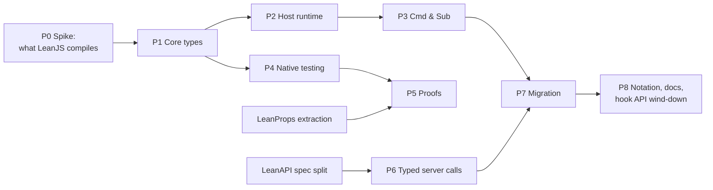

# Declarative components: implementation plan

Status: plan, 2026-09-23. Design: [COMPONENTS.md](COMPONENTS.md). Related: [LR-13, purge LeanApp](https://github.com/theoriclabs/lean-react/issues/43).

The design in one line: **a component is a state machine plus a view, in pure Lean.**
- a typed `Model`;
- named `Msg`s;
- a pure `update : Msg → Model → Model × Cmd Msg`;
- `view : Model → Html Msg`, whose events produce messages;
- effects as data (`Cmd`), long-lived inputs as data (`Sub`).

This plan says how to get there without breaking what works: in phases, each shippable and each with its own tests.

## Principles for the work

- **Additive first.** The new component model lands beside the hook API. Nothing existing is removed until the leanchess UI has migrated and the hook API is no longer needed.
- **Spike the risky parts first.** Every question about what LeanJS can compile is answered by a compiled fixture before the design depends on it.
- **The host stays small.** Lean owns the meaning (`update`, `view`). JavaScript only runs messages, walks `Html` into React elements, and executes commands. React keeps doing diffing and reconciliation.
- **Each phase ships with tests at every level it touches:** Lean (native), compiled JS in jsdom, and browser (Playwright) where DOM behavior matters.

## Overview



| Phase | Ships | Depends on | Size |
|---|---|---|---|
| P0 Spike | Compiled fixtures proving each construct the design needs | — | S |
| P1 Core types | `Html`, `Attr`, `Cmd`, `Sub`, `Component`, element and attribute helpers | P0 | M |
| P2 Host runtime | `program.mjs`: one state slot, atomic dispatch, `Html` → React, interop with hook components | P1 | M |
| P3 Commands and subscriptions | Timers, navigation, focus, storage, an `Action` bridge; subscriptions started and stopped as the model changes | P2 | M |
| P4 Native testing | Pure simulation and `Html` queries in Lean, no browser | P1 | S |
| P5 Proofs | `Component.toSys`; invariants of `update`, theorems about `view` | P4, LeanProps extraction | M |
| P6 Typed server calls | `Cmd.call` typed by LeanAPI endpoint signatures | P3, LeanAPI spec split | L |
| P7 Migration | Counter, Forms, Tickets, then the leanchess UI | P3 (P6 for typed calls) | L |
| P8 Notation, docs, wind-down | Optional JSX-like `html!`, docs, hook API for escape hatches only | P7 | M |

LR-13 (the purge) is independent and can land any time. It should land before P7, so migration doesn't touch code that's about to be deleted.

---

## P0: Spike what LeanJS compiles

**Goal:** know, before committing to the design, that every construct it needs compiles to working JavaScript. Each item becomes a fixture in `tests/compiler/Corpus.lean` (or a new `tests/compiler/Components.lean`) with a jsdom assertion.

| # | Construct | Why it matters | If it fails |
|---|---|---|---|
| 1 | A nested inductive `Html Msg` (node with a `List (Html Msg)`) built and passed to JS | The view is this type | Use `Array`, or a flattened representation |
| 2 | Structural recursion over it in Lean (`Html.map : (α → β) → Html α → Html β`) | Composing children maps their messages | Do mapping in the host: `Html.map` becomes a node carrying the function, applied by the JS walker |
| 3 | Closures inside data (`Attr.on "input" (fun v => .typed v)`) | Event payloads become messages | Already covered by ABI v0; confirm with a fixture |
| 4 | An existential child embed (`structure Embed (Msg) where P M C : Type; …`) and its universe level | Child components with their own model | Erase in the host: an embed carries JS-level values only |
| 5 | `update` returning `Model × Cmd Msg` with a `Cmd` holding closures | Commands carry continuations | Same as 3 |
| 6 | `FromJson` decoding of a record from a `Lean.Json` value built by JS | Needed for P6 decoding; `Json.parse` is not portable (uses `String.Pos`) | The host parses JSON; decoding stays in Lean if `FromJson` compiles, otherwise codecs are generated |
| 7 | Deep views (a chess board is 64 squares × attributes) | Render cost, and the stack depth of recursive walks | Walk in JS iteratively; `Html.lazy` for subtrees |

**Exit:** a short `docs/COMPONENTS.md` addendum recording each result and any design change it forces.

---

## P1: Core types

New modules under `engine/LeanReact/Program/`. They are pure Lean, with no IO and no hooks.

- **`Html.lean`**
  ```lean
  inductive Html (Msg : Type) where
    | text (value : String)
    | node (tag : String) (attrs : List (Attr Msg)) (children : List (Html Msg))
    | keyed (tag : String) (attrs : List (Attr Msg)) (children : List (String × Html Msg))
    | embed (child : Embed Msg)          -- a child component (P0 #4 decides the representation)
    | lazy (key : String) (view : Unit → Html Msg)   -- skip re-walking when `key` is unchanged
    | none
  ```
  `Html.map`, if P0 #2 passes.
- **`Attr.lean`**: `Attr Msg` has three kinds of constructors:
  - plain attributes: `attr`, `boolAttr`, `cls`, `style`;
  - an event with a payload decoder: `on (event : EventKind) (handler : EventData → Option Msg)`;
  - properties (`value`, `checked`).

  Typed helpers wrap them: `onClick (m : Msg)`, `onInput (String → Msg)`, `onSubmit (m : Msg)`, `onKeyDown (KeyEvent → Option Msg)`, `disabled (b : Bool)`, `value (s : String)`, `ariaLabel`, `role`, `id`, `href`, `placeholder`, `type_`, …. The event payload types come from `Core.lean` (`PressEvent`, `KeyEvent`, `InputEvent`, …) and are reused, not duplicated.
- **`Elements.lean`**:
  - `div`, `span`, `section_`, `button`, `input`, `form`, `ul`, `li`, `h1`…`h6`, `p`, `a`, `label`, `table`…, each `List (Attr Msg) → List (Html Msg) → Html Msg`;
  - `text`, `none`, `when (c : Bool) (h : Html Msg)`, `each (xs : List α) (key : α → String) (row : α → Html Msg)`.
- **`Cmd.lean`**: `Cmd Msg` is `none | batch (List (Cmd Msg))`, plus the constructors P3 adds. Also `Cmd.map`.
- **`Sub.lean`**: `Sub Msg` is `none | batch`, plus the constructors P3 adds. Also `Sub.map`.
- **`Component.lean`**
  ```lean
  structure Component (Props Model Msg : Type) where
    init : Props → Model × Cmd Msg
    update : Props → Msg → Model → Model × Cmd Msg
    view : Props → Model → Html Msg
    subscriptions : Props → Model → Sub Msg := fun _ _ => .none
    /-- A new `Props` from the parent, as a message (default: ignore). -/
    propsChanged : Option (Props → Msg) := none
  ```
  Output to a parent (principle 6) is expressed by the parent's `embed` mapping selected child messages, e.g. `toParent : ChildMsg → Option ParentMsg`. So there is no separate `Out` type unless P7 shows it is needed.

**Tests:** native unit tests for `Html.map`, `each` (duplicate keys rejected), and `when`. The P0 fixtures stay in the compiler corpus.

**Exit:** the types compile to JS, and an exported `Component` value round-trips through the ABI.

---

## P2: Host runtime

A new `engine/runtime/program.mjs`, plus adapter exports in `engine/adapters/leanjs-react.mjs`.

- **`ProgramHost`** (one React component per mounted `Component`):
  - Holds the model in one `React.useState`, plus a `latest` ref.
  - **`dispatch(msg)`:**
    1. `const [next, cmd] = update(props)(msg)(latest.current)`;
    2. set `latest.current = next`, then `setModel(next)`;
    3. queue `cmd`.

    Runs in event handlers, never during render. JavaScript is single-threaded, so each dispatch is atomic and sees the previous one's result. This fixes the read-then-write race of `State.read`.
  - **Commands** run after commit: flushed in a `useEffect` without deps, in FIFO order. Results re-enter through `dispatch`.
  - **StrictMode is safe:** `update` is not a React reducer, so double-invoked renders never re-run it.
  - **Props:** a changed `props` re-renders the view. If `propsChanged` is set, the host dispatches it.
- **Html walker:** converts Lean `Html` constructor values to `React.createElement`.
  - `keyed` children become React keys.
  - `on` attributes become handlers that snapshot the event (reusing the existing snapshot code in `react.mjs` `event()`), call the Lean decoder, and dispatch if it returns `some msg`.
  - `lazy` memoizes by key.
  - `embed` mounts a child `ProgramHost` whose dispatch is mapped to the parent.
- **Interop**, so migration can be piecemeal:
  - `Component.toElement : Component P M C → P → Element` embeds a program in a hook-based tree.
  - `Html.element : Element → Html Msg` embeds an existing hook-based element in a view.
- **Intrinsics:** add the new bridge names to `LeanReact/Compiler.lean`. There are no new hook primitives. `ProgramHost` is one fixed React component, so the hook checker is not involved.

**Tests (jsdom, like `tests/integration/counter.test.mjs`):**
- A counter: independent instances and exact bigint arithmetic.
- Atomicity: two dispatches in one event see each other.
- StrictMode: no double updates.
- Keyed reorder keeps each child's model and DOM identity.
- Event payloads for input, keydown and submit (with default prevented).
- A command runs once, after commit.
- Interop in both directions.

**Exit:** the counter and a keyed list run in the browser from `update`/`view` alone.

---

## P3: Commands and subscriptions

- **Cmd constructors** (each interpreted by the host):
  - `after (ms : Nat) (m : Msg)`, a timer;
  - `navigate (path : String)` and `replaceUrl`, integrating with the existing router runtime;
  - `focus (id : String)`;
  - `store (key value : String)` and `load (key) (k : Option String → Msg)`, local storage;
  - `random (n : Nat) (k : ByteArray → Msg)` and `now (k : Nat → Msg)`: randomness and time arrive as messages, so `update` stays pure;
  - `perform (a : Action α) (k : Except IO.Error α → Msg)`: the **bridge** to existing `Action`-based services, so leanchess's `props.api.*` works during migration.
- **Sub constructors:**
  - `every (ms : Nat) (k : Nat → Msg)`;
  - `onKey (k : KeyEvent → Option Msg)` (document-level keys);
  - `source (key : String) (open : Action (Action Unit)) (k : …)`, the bridge for host event sources such as leanchess's `watch`.

  Every subscription has a **key**. After each commit the host diffs the keys of `subscriptions props model`: it starts the new ones, stops the removed ones, and keeps the unchanged ones. This replaces `useEffect` dependency arrays.
- **Tests:** timers under fake time; a subscription starts and stops as the model changes, with no leaked sources; `perform` errors arrive as messages.

**Exit:** leanchess's `watch` loop and its sign-in flow can be expressed with `Sub.source` and `Cmd.perform`.

---

## P4: Native testing

- `Component.simulate (c) (props) (msgs : List Msg) : Model × List (Cmd Msg)`: pure. It records commands without running them.
- `Html` queries for tests: `findByText`, `findByRole`, `findByLabel`, and `click : Html Msg → Selector → Option Msg`. "Clicking *Resign* produces `.resign`" then becomes a native test, with no DOM.
- A native pretty-printer for `Html` (native-only; `partial` is fine here, since it never compiles to JS). It gives snapshot tests of the view.

**Exit:** the counter and form examples have native tests of their whole behavior, alongside the jsdom tests.

---

## P5: Proofs

- **Prerequisite: extract the property kernel.** `LeanApi.Props` (systems, invariants, the operator algebra, `preserves`, `#check_invariant`) moves from LeanAPI into its own small package, e.g. `theoriclabs/leanprops`. Both LeanAPI and LeanReact depend on it, so LeanReact never depends on the server. The extraction is a mechanical move plus re-exports in LeanAPI. Tracked as a LeanAPI ticket.
- `Component.toSys : Component P M C → P → Props.Sys`: the world is the `Model`, requests are messages, and a step is `update` (the `Cmd` is the step's output).
- `preserves` learns the `Model × Cmd Msg` return shape, so component invariants are one line, like domain invariants:
  ```lean
  invariant Board.Consistent (m : Model) where
    selectionIsMine : m.selection.isMineIn m.game
    promotionPending : m.selection.promoting → m.game.hasPromotionFrom …
  preserves Board.Consistent by Board.update
  ```
- **View theorems** are plain statements about a pure function. For example, `(view m).find (button "Save") |>.disabled = !m.form.valid`.
- **Examples:** the Counter (a bound), the form ("invalid form never emits `submitted`"), and later leanchess ("a selection is always one of my pieces").

**Exit:** at least three UI theorems pass the axiom audit, as they do in LeanAPI.

---

## P6: Typed server calls

The UI calls the server through the **same types** that define the server.

- **Prerequisite: split LeanAPI's endpoint description from its server runtime.** The browser needs a spec it can compile: the input wrappers (`Path`, `Query`, `Body`, `Header`, `IfMatch`, `Auth`), the response types, and each endpoint's method, template and signature. It must not pull in `Std.Http`, IO, SQLite or crypto. This is `LeanApi.Spec`, a LeanJS-compilable module or package. It is a LeanAPI ticket.
- **Type-level computation from the handler type** `τ` (outParams, computed by instance resolution, as `Handler` already does on the server):
  - `Args τ`: the client-supplied inputs. Path, query, body and headers are included; `Auth` and `FreshToken` are not.
  - `Response τ`: the declared answer, e.g. `Except GameError (Versioned GameView)`.
- **The call:**
  ```lean
  Cmd.call (e : ClientEndpoint τ) (args : Args τ) (k : Except CallFailure (Response τ) → Msg)
  ```
  - Request building (path segments, query, JSON body, headers) is derived per input wrapper.
  - Response decoding is derived from `Response τ`: status, then the success body or the `ToProblem` failure.
  - `CallFailure` covers transport, 401 and malformed answers.
  - Because `k` receives `Response τ`, `update` must handle every failure the endpoint declares. That's the cross-boundary guarantee.
- **The host side:** `fetch`, `JSON.parse` into Lean `Json` values (P0 #6), abort on unmount, and the auth token source as a host capability.
- **Proof direction** (later, optional): client encoding and server decoding round-trip for each input wrapper. That is a theorem about the shared spec, not a test.

**Exit:** the private-games UI calls `gamesApi` endpoints with typed results, and an exhaustive `match` on `GameError` in `update` is enforced by the compiler.

---

## P7: Migration

In order, each a separate PR:

1. **The Counter and Collections examples** (`examples/lean/Examples/*`), with their browser specs unchanged.
2. **Forms:**
   - `useForm`/`Editor` become a `Form` component. Field state lives in the model, and validation goes through `LeanOntology.Validation`.
   - It reports `submitted value` outward.
   - `tests/browser/forms.spec.mjs` must be unchanged.
3. **Tickets** (`examples/lean/Examples/Tickets/*`): list, card and editor. It uses `Cmd.perform` over the existing service first, then `Cmd.call` once P6 lands.
4. **leanchess UI** (the real test):
   - Ten cells become one `Model`, with a `Selection` inductive (`none | piece | promoting`).
   - Stringly fields become domain types; `Look` fields become enums.
   - The press/move/promote logic moves into `update`, and legal-move filtering stays shared with the server.
   - `watch` becomes a `Sub.source` keyed by game id.
   - Its hook-checker fuel override is removed.
   - Its end-to-end behavior must be unchanged.
   - Invariants from P5: "a selection is always my piece", "the promotion prompt means a promotion move is pending".

**Exit:** leanchess ships on the component model. Its UI has no `useState`, and at least two UI theorems about it are proved.

---

## P8: Notation, docs, hook API wind-down

- **Optional JSX-like notation.** An `html!` term syntax that expands to the P1 combinators:
  ```lean
  html! <button class="primary" onClick={.start} disabled={busy}>Start</button>
  ```
  It is pure sugar. It only lands if the combinators prove noisy in P7.
- **Docs:**
  - `docs/LEANREACT.md` and `docs/HOW_TO.md` are rewritten around components;
  - COMPONENTS.md goes from design to reference;
  - the README gets a short example;
  - a blog post, like LeanAPI's.
- **The hook API** stays, documented as the low-level escape hatch, like `Route` in LeanAPI. Removing it is a later decision, made only when nothing uses it.

## Cross-repo tickets to open

| Repo | Ticket | Needed by |
|---|---|---|
| lean-react | LR-13 purge LeanApp ([#43](https://github.com/theoriclabs/lean-react/issues/43)) | Before P7 |
| lean-react | P0–P8 as LR-14… (one per phase) | This plan |
| leanapi | Extract the property kernel into its own package (`leanprops`) | P5 |
| leanapi | Split `LeanApi.Spec` (LeanJS-compilable endpoint descriptions) from the server | P6 |
| leanchess | Migrate the UI to the component model | P7 |

## Risks

| Risk | Mitigation |
|---|---|
| LeanJS cannot compile a construct the design relies on (nested inductives, existentials, `FromJson`) | P0 answers each question first; each has a fallback that moves the work to the host |
| Walking `Html` every render is slow for big views (a chess board) | `Html.lazy` keyed subtrees and React keys; measure with the existing benchmark script in P2 |
| Two component models coexist for a while | Interop both ways (P2); hooks are documented as the escape hatch; migration is ordered |
| Typed calls need the LeanAPI spec split, which may be large | P3's `Cmd.perform` bridge unblocks migration without it; P6 lands when the split does |
| The property kernel extraction changes LeanAPI's imports | It is a mechanical move with re-exports; LeanAPI's axiom audit and evidence check gate it |
| The repo has no CI | Each phase's gates run locally, as in LR-13; add CI once the org's GitHub Actions billing is fixed |
