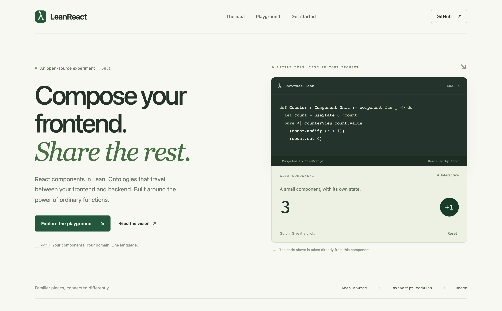
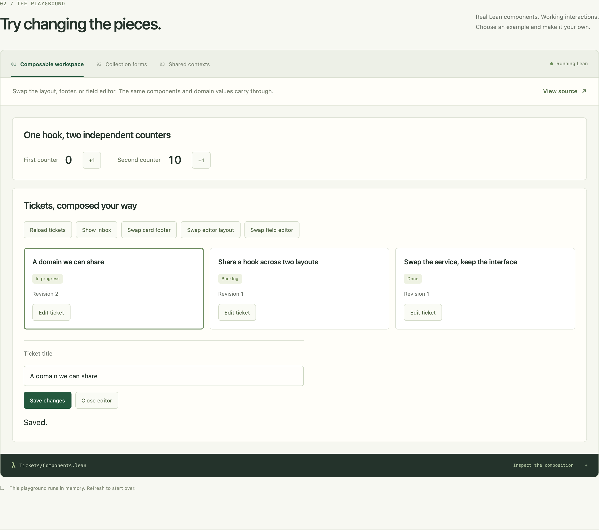
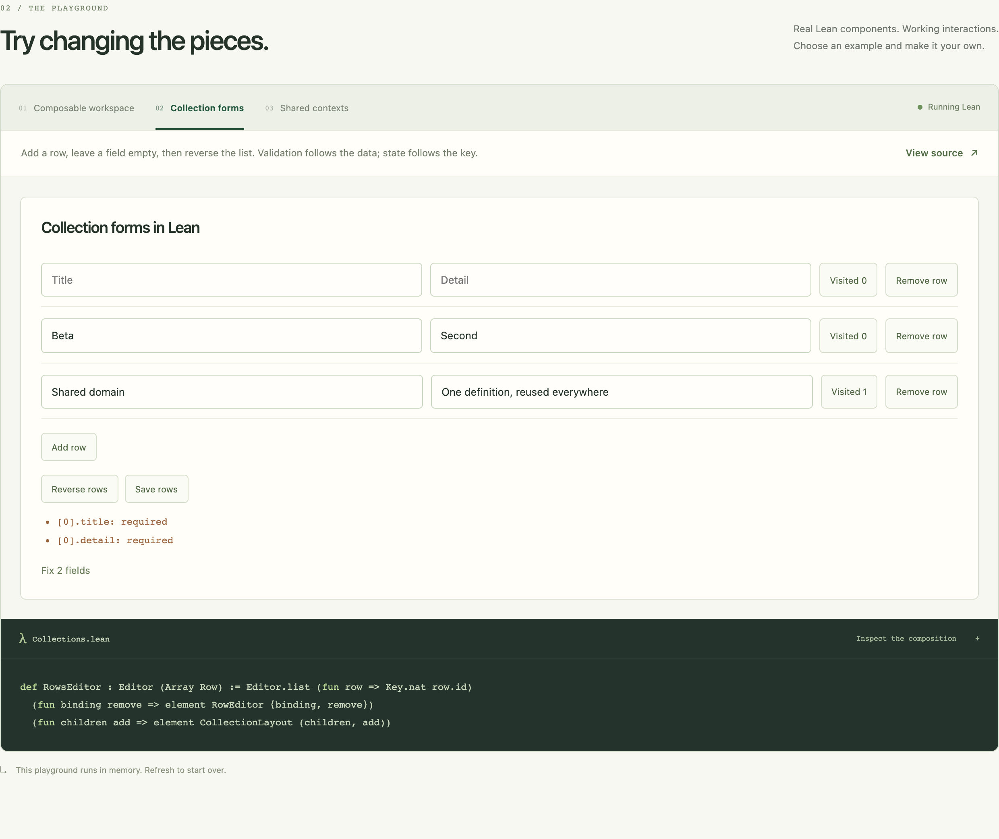

# LeanReact

[Documentation](README.md) · [LeanReact](../README.md) · [Frontend tutorial](HOW_TO.md)

LeanReact is LeanApp's frontend library. Use it on its own to author React components in Lean; the native server and database adapters are optional. This page describes the frontend path, including the published v0.1 examples.

Write React components in Lean, a typed functional language. Your components compile to JavaScript and run in the browser using React.

The appeal is familiar if you use TypeScript across the stack: your frontend and backend can share types and validation rules. Props, state, hooks, and components you can pass into other components remain the core UI building blocks.

[v0.1 release](https://github.com/theoriclabs/lean-react/releases/tag/v0.1) · [Get started](#run-locally) · [How-to guide](HOW_TO.md) · [Agent skill](../SKILL.md)

For the full-stack café and native application APIs, start with [LeanApp getting started](GETTING_STARTED.md). Those additions are not part of the published v0.1 frontend release.



## Run locally

You’ll need Git, Node 22.13 or newer, and [elan, the Lean version manager](https://github.com/leanprover/elan#installation). Think of elan like nvm: it installs the Lean version selected by this project. Follow its installation instructions for your OS, then open a new terminal.

```sh
git clone --branch v0.1 https://github.com/theoriclabs/lean-react.git
cd lean-react
npm ci
npm run dev
```

Open **http://localhost:4173**. The first build may download the Lean compiler. The examples run in browser memory, so you can try them immediately.

Start by editing the [counter component](../examples/lean/Examples/Showcase.lean). The dev server rebuilds when you save; refresh the browser to see the change.

## A counter in Lean

<!-- lean-check: frontend-counter -->
```lean
import LeanReact
open LeanReact

structure CounterProps where
  label : String

def Counter : Component CounterProps := component fun props => do
  let count ← useState 0 "count"
  pure <| DOM.button {
    onPress := some (count.modify (fun value => value + 1))
  } #[
    text (props.label ++ ": " ++ toString count.value)
  ]
```

Read this as a React function component:

- `structure CounterProps` defines the props, like a TypeScript interface.
- `useState` gives you `count.value`, `count.set`, and `count.modify`. The last one works like `setCount(previous => previous + 1)`. `"count"` is a stable label for the hook.
- `DOM.button` creates a button; `#[...]` contains its children. `onPress` runs the update when clicked.

A few syntax hints: `fun value => ...` is an arrow function, `some` supplies an optional prop, and `++` joins strings. `←` reads the result of a hook; `pure <|` returns the rendered element.

The [first-form tutorial](HOW_TO.md#build-your-first-form) walks through complete files, including compiling and mounting a component.

## Build by composing

Pass an editor into a form. Pass a row component into a list. Share a custom hook between two layouts. These are ordinary values and functions, so you can change one piece without rewriting the whole screen.

The playground includes:

- A ticket workspace with interchangeable layouts and field editors.
- Collection forms that keep each row’s state when you reorder them and preserve invalid input while you edit.
- A context provider and consumer built in separate libraries that share live updates.
- A feedback form built from typed `form`, `textarea` and `select` helpers: blur validation, paste handling, Enter-to-submit without a reload, and a key handler that decides whether the browser default runs.
- A canvas widget driven through a typed imperative handle, and a two-screen routed example under `/router/` with deep links, back/forward, and in-place link clicks.





Shared domain definitions, called *ontologies* in this project, describe application data and its rules. For example, the same title validator can run in your form and on a Lean backend. Start with a type and a parsing function; add richer descriptions when your application needs them.

## DOM, forms and accessibility

`DOM.*` helpers cover the ordinary HTML surface with typed props: headings through `h6`, landmarks (`nav header footer main aside`), text (`strong em code pre kbd`), tables, `img`, `dialog`, `details`/`summary`, and the controls `input`, `textarea`, `select`/`«option»`, `button` and `form`. Shared props include `tabIndex`, `hidden`, `data` (rendered as `data-*`), the common `aria*` attributes and an inline `style` array keyed by a closed `StyleProp` enum, so a misspelled CSS property is a compile error. Every event arrives as a small immutable Lean record: `PressEvent`, `ChangeEvent`, `KeyEvent`, `FocusEvent`, `InputEvent`, `PasteEvent`, `ScrollEvent`. A `form` never navigates: its submit default is always prevented before `onSubmit` runs. `onKeyDown` returns a `KeyOutcome` (`.continue` or `.preventDefault`); handlers returning `Action Unit` still compile and mean `.continue`. See the [API reference](../engine/LeanReact/API.md#dom-helpers-and-events) for the full table and accessibility notes.

## CSS and existing React libraries

Use regular CSS files and `className` props. JavaScript and TypeScript can consume the generated components too.

Existing React libraries need an explicit binding between their props and Lean. There’s a working foreign-component example in the [interop guide](HOW_TO.md#existing-react-components-including-shadcn). shadcn and Tailwind aren’t configured out of the box.

## What to expect from v0.1

This is an experimental release for trying Lean-authored frontends. The examples demonstrate working components, forms, asynchronous data loading, and shared domain rules. APIs can change. Only a subset of Lean compiles to JavaScript today; a minimal typed router exists, while nested routing, React Server Components, and automatic JS/TS bindings are still ahead. See [current support and limits](IMPLEMENTED.md).

To build your own screen, follow the [how-to guide](HOW_TO.md). If you’re using a coding agent, ask it to read [SKILL.md](../SKILL.md) first.

Application code lives in [examples/](../examples/README.md); reusable framework code lives in [engine/](../engine/README.md). Contributor checks, optional backend setup, and architecture details are in the [development guide](HOW_TO.md#check-and-debug-your-work) and [backend guide](NATIVE.md).
