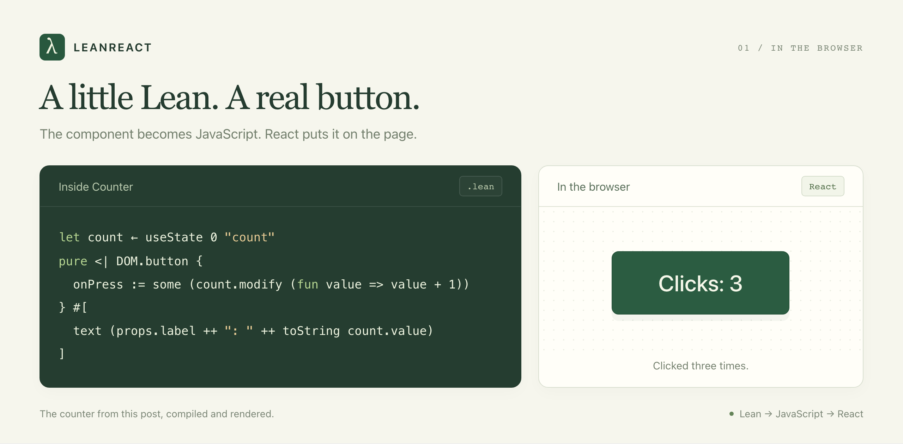
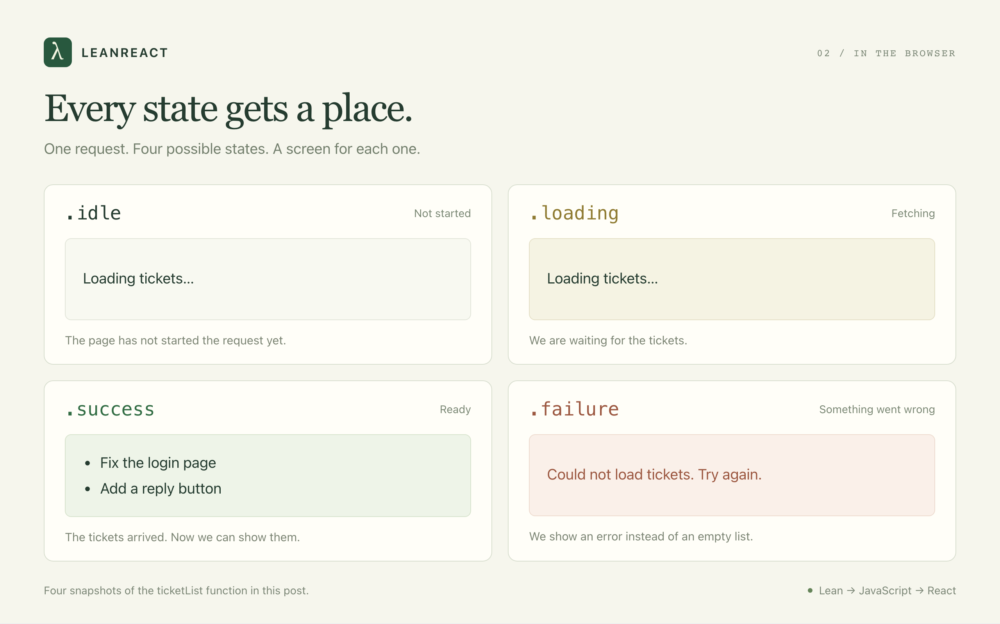

# LeanReact: Composable and Correct React Components in Lean

The intention of LeanReact is to be able to specify composable and correct React components in Lean. We talked about [why Lean types are great in the Lean DB post](https://theoric.com/blog/leandb_a_strongly_typed_sql_frontend/). The same types are also great for expressing frontend components. Today, I want to introduce LeanReact 0.1 and show you its power with some examples.

## Start with a button

Here is a counter in Lean:

```lean
import LeanReact
open LeanReact

structure CounterProps where
  label : String

def Counter : Component CounterProps := component fun props => do
  let count ← useState 0 "count"
  pure <| DOM.button {
    onPress := some (count.modify (fun value => value + 1))
  } #[
    text (props.label ++ ": " ++ toString count.value)
  ]
```

`CounterProps` is the props type. `useState` holds the count. Clicking the button updates it. `count.modify` works like React's `setCount(previous => previous + 1)`.

The syntax takes a little getting used to. `fun` introduces a function. `#[...]` holds the button's children. `some` supplies an optional prop, and `pure <|` returns the element. `"count"` names the hook.



*The counter above, running in the browser after three clicks.*

[Try the counter →](https://leanreact.com/counter.html)

Now let's load something.

## Make loading states hard to forget

Suppose our support team needs a list of open tickets. A common React implementation starts with three fields:

```ts
const [data, setData] = useState<Ticket[] | null>(null);
const [loading, setLoading] = useState(false);
const [error, setError] = useState<string | null>(null);
```

These fields can disagree. A request fails and sets `error`, but nobody clears `loading`. Or the page treats `data === null` as an empty list, even though it hasn't asked the server yet.

LeanReact's `useResource` gives you one state with four possible cases:

- `idle`: the request hasn't started.
- `loading`: the request is running.
- `success`: the request returned a value.
- `failure`: the request failed.



*Each state has a place on the screen.*

[Try the loading states →](https://leanreact.com/states.html)

The data lives inside `success`. You check the state before reading it.

Here is how we show the ticket titles:

```lean
import LeanReact
open LeanReact

def ticketList (state : ResourceState (Array String) String) : Element :=
  match state with
  | .idle => DOM.p {} #[text "Loading tickets…"]
  | .loading _ => DOM.p {} #[text "Loading tickets…"]
  | .failure _ (.loader message) =>
      DOM.p { role := some "alert" } #[text message]
  | .failure _ (.exception _) =>
      DOM.p { role := some "alert" } #[text "Could not load tickets. Try again."]
  | .success _ titles =>
      if titles.isEmpty then
        DOM.p {} #[text "No open tickets. You're all caught up."]
      else
        DOM.ul {} (titles.map fun title => DOM.li {} #[text title])
```

`match` is like a `switch` that must cover every case. Delete the `loading` branch and the code won't compile. The request also can't be loading and failed at the same time.

The `_` means “we don't need this value here.”

Notice where “No open tickets” appears: inside `success`. We only say the queue is empty after getting an answer. No more flashing an empty list while the page loads.

The two failure branches cover errors we expect and unexpected errors. If loading throws an exception, `useResource` catches it so we can show an error message.

Write out the cases you care about. A shortcut like `_ => empty` can hide a missing screen behind a blank page.

You can [use this pattern in TypeScript](https://www.typescriptlang.org/docs/handbook/2/narrowing.html#exhaustiveness-checking) too. In LeanReact, it's built into `useResource`.

### What about a refresh?

The team clicks Reload while looking at ten tickets. We want those tickets to stay on screen while the new list loads.

The [Tickets example](../../examples/lean/Examples/Tickets/Components.lean) does this by keeping a copy of the last list. It shows those rows with a loading message above them. If the refresh fails, the rows stay.

It also checks ticket versions. If someone just saved an edit, an older response won't overwrite it.

### What about incomplete data?

Sometimes the tickets arrive before the names of the people assigned to them. Each request has its own state. You can wait for both, or show the tickets while the names load.

Some tickets have nobody assigned at all. Lean represents that with `Option`: either `some` value or `none`. The code has to allow for both. That gives you a place to show “Unassigned” instead of trying to read a person who isn't there.

## Compose the editor from smaller pieces

Now the support team wants two ways to edit a ticket: a quick editor beside the list and a larger editor on the detail page.

Both need the same title validation and save behavior. Copying the whole editor would give us two places to fix every bug.

You can pass one component into another as a prop. Here is a title field that lets us choose which input to use:

```lean
import LeanReact
import LeanReact.Forms
open LeanReact

def TitleInput : Editor String := component fun field =>
  pure <| DOM.input {
    value := some field.value
    ariaLabel := some "Ticket title"
    onChange := some (fun event => field.set event.value)
  }

structure TitleFieldProps where
  editor : Editor String := TitleInput

def TitleField : Component TitleFieldProps := component fun props => do
  let draft ← useState "Fix the login page" "title"
  pure <| element props.editor (FieldBinding.ofState draft)
```

An `Editor String` receives the text and a way to change it. `TitleField` keeps the draft. The editor displays it. Swap the input for a textarea, and the parent still keeps the text you've typed.

In the full Tickets example, a `useTicketEditor` hook checks the title, saves changes, and shows messages. The sidebar and detail page both use it. Fix the save code once, and both get the fix.

The list also lets you choose how each row looks. A ticket card lets you choose its footer. You can change either without touching the code that loads or saves tickets.


*Swap the input for a textarea. The text you've typed stays.*

[Try swapping the editor →](https://leanreact.com/editors.html)

Lean checks that the pieces fit. Pass a number editor to a text field, and it tells you something is wrong.

## Let people finish typing

Suppose ticket titles must contain between 1 and 200 characters. Someone selects the whole title and presses Backspace before writing a better one.

The empty field is invalid as a saved title. It is perfectly normal as a draft.

LeanReact keeps what the person typed, even when it isn't a valid title yet. A `DraftParser` checks the text. `Form.submit` only passes it to the save function when those checks pass.

So the user can clear the field, see “Give the ticket a title,” and keep typing. Their input isn't discarded because it failed validation.


*The form keeps the draft and explains what needs fixing.*

[Try the form →](https://leanreact.com/forms.html)

The browser and a Lean backend can use the same title check. Change the length limit in one place, and both agree on it.

These checks work together in bigger forms too. Say someone is editing ten tickets at once. You can check every title and description, then show all the errors together. They don't have to fix one field and submit again just to discover the next problem.

## A few more mistakes the compiler catches

Accidentally put `count.set 0` in the render body? Lean catches it. State updates belong in a click handler or an effect.

Hooks get checked too. If an `if` statement makes a hook run only on some renders, the build fails. Put that part of the screen in a child component instead.

LeanReact won't catch every bug. You can still get an effect wrong or break the layout. Keep testing the app and trying it in a browser.

## Try it

LeanReact 0.1 is an early release. Some Lean features aren't supported yet, and using other React libraries takes extra setup. See the [implementation guide](../IMPLEMENTED.md) for what's available today.

With Git, Node 22.13 or newer, and [elan](https://github.com/leanprover/elan#installation) installed, run:

```sh
git clone --branch v0.1 https://github.com/theoriclabs/lean-react.git
cd lean-react
npm ci
npm run dev
```

Open **http://localhost:4173**. The examples run in browser memory, so you can try the ticket workspace without setting up a server.

Start with the counter. Then swap the ticket editor, or remove a branch from a resource match and read the compiler's response. The [how-to guide](../HOW_TO.md) walks through building your own form.
