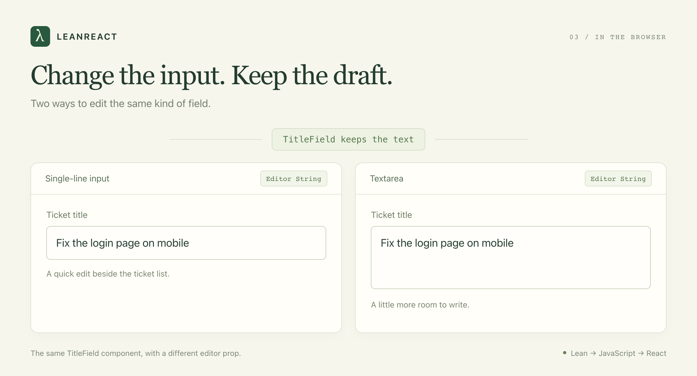
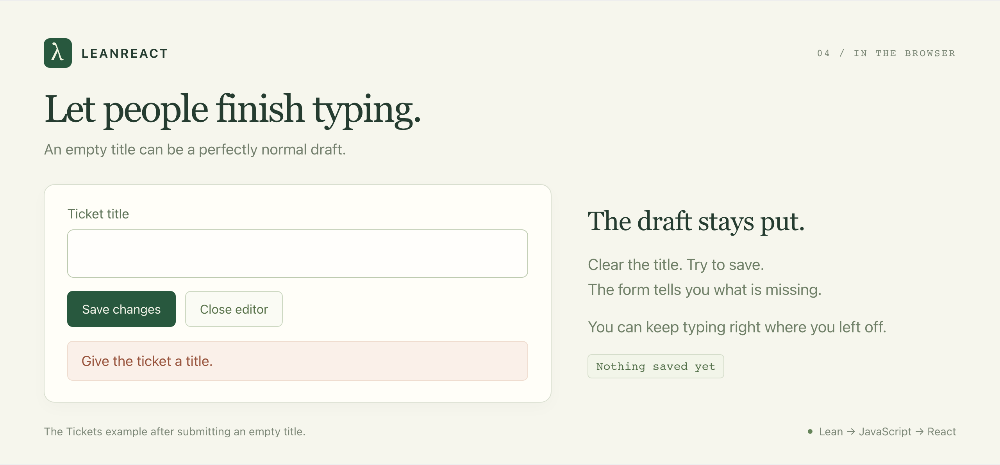

# LeanReact: Expressing Composable and Correct React Components in Lean

The intention of LeanReact is to be able to specify composable and correct React components in Lean. We talked about [why Lean types are great in the Lean DB post](https://theoric.com/blog/leandb_a_strongly_typed_sql_frontend/). The same types are also great for expressing frontend components. Today, I want to introduce LeanReact 0.1 and show you its power with some examples.

LeanReact makes it easier to express composable and correct React Components.

## Example 1: Stop the checkout from reaching impossible states

Here is a multi-step checkout the way it usually gets written:

```ts
const [currentStep, setCurrentStep] = useState(1); // 1 shipping, 2 payment, 3 review
const [isSubmitting, setIsSubmitting] = useState(false);
const [hasError, setHasError] = useState(false);
const [isPaymentValidated, setIsPaymentValidated] = useState(false);
const [showDiscountModal, setShowDiscountModal] = useState(false);
```

Each `useState` is a slot that varies on its own. Multiply the options: \(3 \times 2 \times 2 \times 2 \times 2 = 48\) states this component can be in. Only 10 out of these 48 states are valid. In real world example, the number possible states are LOT more, and you almost always forget to handle a valid state, and spend unnecessary time handling states which will probably never occur.

Same state expressed as Lean's inductive types:

```lean
import LeanReact
open LeanReact

structure Shipping where
  address : String

structure Payment where
  cardLast4 : String

inductive Checkout where
  | shipping (draft : String)
  | payment (shipping : Shipping) (draft : String)
  | review (shipping : Shipping) (payment : Payment)
  | submitting (shipping : Shipping) (payment : Payment)
  | failed (shipping : Shipping) (payment : Payment) (message : String)
```

I think it's much simpler, and only the valid states are representable.

### How to render the state

Rendering is a `match`, and the match has to cover every case:

```lean
def checkoutView (checkout : Checkout) (placeOrder : Action Unit) : Element :=
  match checkout with
  | .shipping draft =>
      DOM.p {} #[text ("Shipping address: " ++ draft)]
  | .payment _ draft =>
      DOM.p {} #[text ("Card number: " ++ draft)]
  | .review _ payment =>
      DOM.button { onPress := some placeOrder }
        #[text ("Place order with card ending " ++ payment.cardLast4)]
  | .submitting _ _ =>
      DOM.p { role := some "status" } #[text "Placing your order…"]
  | .failed _ _ message =>
      DOM.p { role := some "alert" } #[text message]
```

The spinner text lives in exactly one branch, and that branch only runs when the state is `submitting`. Delete the `.submitting` arm and the compiler answers `Missing cases: Checkout.submitting …`. Compare that to the React version, where a spinner is `{isSubmitting && <Spinner />}` placed somewhere in the tree, and nothing checks whether the form underneath it is one you should be spinning over.

You can write this union in TypeScript too, and you should. The difference here is that there is no `as`, no `!`, and no `any` to slip past the match, and the same `Checkout` type can be handed to a Lean backend that decides whether the order is placeable.

## Example 2: Compose the editor from smaller pieces

Now the support team wants two ways to edit a ticket: a quick editor beside the list and a larger editor on the detail page.

Both need the same title validation and save behavior. Copying the whole editor would give us two places to fix every bug.

You can pass one component into another as a prop. In React, you define the contract yourself:

```tsx
type EditorProps = { value: string; onChange: (value: string) => void };

function TitleInput({ value, onChange }: EditorProps) {
  return <input aria-label="Ticket title" value={value} onChange={(e) => onChange(e.target.value)} />;
}

function TitleTextarea({ value, onChange }: EditorProps) {
  return <textarea aria-label="Ticket title" value={value} onChange={(e) => onChange(e.target.value)} />;
}

function TitleField({ Editor }: { Editor: ComponentType<EditorProps> }) {
  const [draft, setDraft] = useState("Fix the login page");
  return <Editor value={draft} onChange={setDraft} />;
}

<TitleField Editor={TitleInput} />
<TitleField Editor={TitleTextarea} />
```

Same thing in LeanReact:

```lean
import LeanReact
import LeanReact.Forms
open LeanReact

def TitleInput : Editor String := component fun field =>
  pure <| DOM.input {
    ariaLabel := some "Ticket title"
    value := some field.value
    onChange := some (fun event => field.set event.value)
  }

def TitleTextarea : Editor String := component fun field =>
  pure <| node "textarea" #[
    .string "aria-label" "Ticket title",
    .string "value" field.value,
    .change (fun event => field.set event.value)
  ] #[]

def TitleField : Component (Editor String) := component fun editor => do
  let draft ← useState "Fix the login page" "title"
  pure <| element editor (FieldBinding.ofState draft)

def quickEditor : Element := element TitleField TitleInput
def detailEditor : Element := element TitleField TitleTextarea
```

The two versions are the same length and the same shape. The contrast is in what you had to invent:

| | React | LeanReact |
| --- | --- | --- |
| The editor contract | `EditorProps`, written by you. The next team writes `onValueChange`, the library you import gives you the raw event. | `Editor String` is built in. Every editor in the codebase receives the same `FieldBinding`. |
| What `onChange` hands you | A DOM event. `e.target.value` for an input, a different event type for a textarea, something else for a date picker. | A snapshot with `.value`. Input and textarea are interchangeable without an adapter. |
| Where the draft lives | In `TitleField`, because you lifted it. Put it in the editor instead and swapping editors loses the text. | An `Editor` receives a binding; it has no slot for its own draft. The parent owns it by construction. |
| Updating from the previous value | `setDraft(d => d + "!")` | `field.modify (· ++ "!")`, plus `field.focus` for editing one field of a record while keeping its siblings. |

Pass a number editor where a text editor is expected and both compilers complain. That part is even. What LeanReact adds is one contract for every editor, so the swap in the screenshot below needs no glue.



*Swap the input for a textarea. The text you've typed stays.*

[Try swapping the editor →](https://leanreact.com/editors.html)

## Let people finish typing

Suppose ticket titles must contain between 1 and 200 characters. Someone selects the whole title and presses Backspace before writing a better one.

The empty field is invalid as a saved title. It is perfectly normal as a draft.

LeanReact keeps what the person typed, even when it isn't a valid title yet. A `DraftParser` checks the text. `Form.submit` only passes it to the save function when those checks pass.

So the user can clear the field, see “Give the ticket a title,” and keep typing. Their input isn't discarded because it failed validation.



*The form keeps the draft and explains what needs fixing.*

[Try the form →](https://leanreact.com/forms.html)

The browser and a Lean backend can use the same title check. Change the length limit in one place, and both agree on it.

These checks work together in bigger forms too. Say someone is editing ten tickets at once. You can check every title and description, then show all the errors together. They don't have to fix one field and submit again just to discover the next problem.

## A few more mistakes the compiler catches

Accidentally put `count.set 0` in the render body? Lean catches it. State updates belong in a click handler or an effect.

Hooks get checked too. If an `if` statement makes a hook run only on some renders, the build fails. Put that part of the screen in a child component instead.

LeanReact won't catch every bug. You can still get an effect wrong or break the layout. Keep testing the app and trying it in a browser.

## Try it

LeanReact 0.1 is an early release. Some Lean features aren't supported yet, and using other React libraries takes extra setup. See the [implementation guide](https://github.com/theoriclabs/lean-react/blob/main/docs/IMPLEMENTED.md) for what's available today.

With Git, Node 22.13 or newer, and [elan](https://github.com/leanprover/elan#installation) installed, run:

```sh
git clone --branch v0.1 https://github.com/theoriclabs/lean-react.git
cd lean-react
npm ci
npm run dev
```

Open **http://localhost:4173**. The examples run in browser memory, so you can try the ticket workspace without setting up a server.

Start with the checkout type. Then swap the ticket editor, or remove a branch from the checkout match and read the compiler's response. The [how-to guide](../HOW_TO.md) walks through building your own form.
